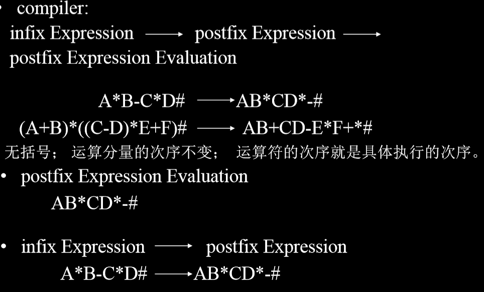
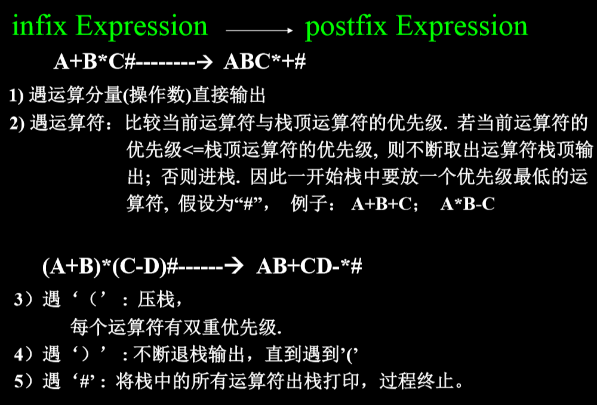
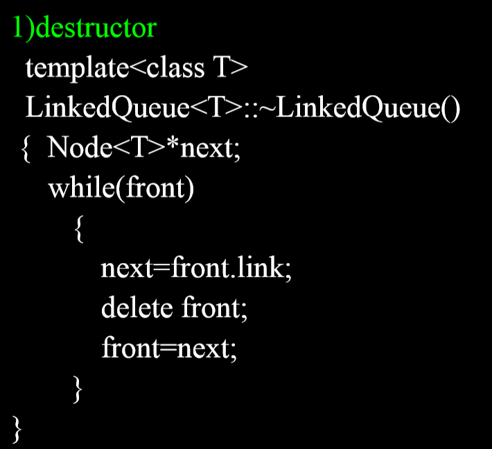
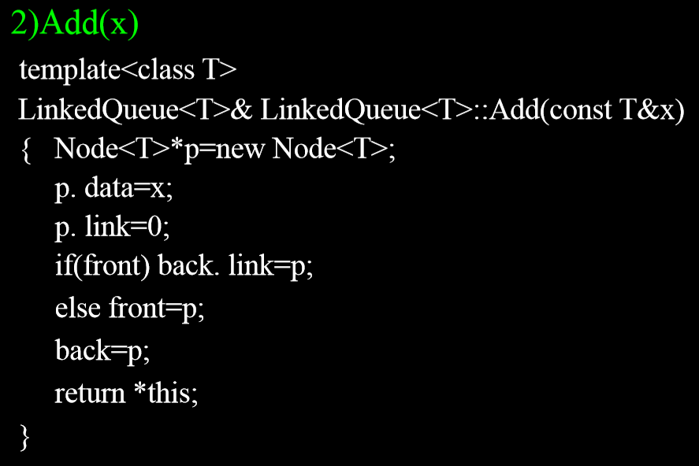

Stack and Queue
---
1. 栈和队列是逻辑上的结构，在物理上可以用数组和链表来实现。

<!-- TOC -->

- [1. 栈](#1-栈)
  - [1.1. 栈的模型](#11-栈的模型)
  - [1.2. 栈的实现](#12-栈的实现)
    - [1.2.1. 单链表实现](#121-单链表实现)
  - [单链表栈的方法实现](#单链表栈的方法实现)
    - [1.2.2. 数组实现栈](#122-数组实现栈)
  - [栈的数组实现](#栈的数组实现)
  - [数组实现的栈的方法实现](#数组实现的栈的方法实现)
  - [1.3. 栈的特点](#13-栈的特点)
  - [1.4. 创新的栈的实现](#14-创新的栈的实现)
  - [1.5. 栈的使用](#15-栈的使用)
    - [1.5.1. Balancing Symbols(Parenthesis Matching) 括号匹配](#151-balancing-symbolsparenthesis-matching-括号匹配)
    - [1.5.2. 例二:Expression Evaluation](#152-例二expression-evaluation)
  - [中缀表达式转换后缀表达式](#中缀表达式转换后缀表达式)
- [2. 队列](#2-队列)
  - [2.1. Queue Model](#21-queue-model)
  - [2.2. 队列的数组实现](#22-队列的数组实现)
  - [2.3. 队列的单链表实现](#23-队列的单链表实现)
    - [2.3.1. 一些方法的实现](#231-一些方法的实现)
  - [2.4. 应用](#24-应用)
    - [2.4.1. 杨辉三角](#241-杨辉三角)
    - [2.4.2. 寻找路径 Wire Routing](#242-寻找路径-wire-routing)
- [3. 2009年全国考研统考题](#3-2009年全国考研统考题)

<!-- /TOC -->

# 1. 栈
1. A stack is a list in which insertions and deletions take place at the same end. This end is called the top. The other end of the list is called the bottom. It is also called a LIFO(last-in-first-out) list. 栈是一个插入和删除都发生在最后面的链表，这个最后面被我们称作top，而链表的另一边被我们称作bottom.这个链表被我们成为LIFO(后进先出)列表
2. 理论上有方法:push,pop

## 1.1. 栈的模型
```java
AbstractDataType Stack{
    instances
        list of elements;
        one end is called the  bottom;
        the other is the top;
    operations
        Create():Create an empty stack;
        IsEmpty():Return true if stack is empty,return  false otherwise
        IsFull ():Return true if stack if full,return false otherwise;
        Top():return top element of the stack;
        Add(x): add element x to the stack;
        Delete(x):Delete top element from stack and put it in x;
}
```

## 1.2. 栈的实现

### 1.2.1. 单链表实现

1. 最后面是栈底，而表头是栈顶。
```java
public class StackLi {
    public StackLi(){ topOfStack = null; }
    public boolean isFull(){ return false; }
    public boolean isEmpty(){ return topOfStack = = null; }
    public void makeEmpty(){ topOfStack = null; }
    public void push(object x)
    public object top()
    public void pop() throws Underflow;
    public object topAndPop()
    private  ListNode  topOfStack;
}
```
单链表栈的方法实现
---
```java
public void push(object x){
    topOfStack = new ListNode(x, topOfStack);
}
public object top(){
    if(isEmpty())
        return null;
    return topOfStack.element;
}
public void pop() throws Underflow {
    if(isEmpty())
        throw new Underflow();
    topOfStack = topOfStack.next;
}

public object topAndPop(){
    if(isEmpty())
        return null;
    object topItem = topOfstack.element;
    topOfStack = topOfStack.next;
    return topItem;
}
```

### 1.2.2. 数组实现栈


1. 数组靠后的部分(如上图)是栈顶。

栈的数组实现
---
```java
public class stackAr {
    public StackAr()
    public StackAr(int capacity)
    public boolean isEmpty(){ return topOfStack = = -1; }
    public boolean isFull(){ return topOfStack = = theArray.length – 1; } 
    public void makeEmpty(){ topOfStack = -1; }
    public void push(object x) throws  overflow public object top()
    public void pop() throws  Underflow public object topAndPop()
    private object [] theArray;
    private int topOfStack;
    static final int DEFAULT_CAPACITY = 10;
}
```
数组实现的栈的方法实现
---
```java
public StackAr(){
    this(DEFAULT_CAPACITY);
}
public StackAr(int capacity) {   
    theArray = new object [capacity];
    topOfStack = -1;
}
public void push(object x) throws Overflow {
    if (isfull())
        throw new Overflow();
    theArray[++topOfStack] = x;
}
public object top() {
    if( isEmpty())
        return null;
    return theArray[ topOfStack ];
}
public void pop() throws Underflow {
    if(isEmpty())
        throw new Underflow( );
    theArray[ topOfStack-- ] = null;
}
public object topAndPop() {
    if(isEmpty())
        return null;
    object topItem = top( );
    theArray[ topOfStack-- ] = null;
    reurn topItem;
}
```

## 1.3. 栈的特点
1. 无论是什么方法，时间复杂度都是O(1)

## 1.4. 创新的栈的实现

1. 从两头向中间存储栈

## 1.5. 栈的使用

### 1.5.1. Balancing Symbols(Parenthesis Matching) 括号匹配
```c++
//c++
#include <iostream.h>
#include <string.h>
#include <stdio.h>
#include "stack.h"
const int Maxlength = 100; // max expression length
using namespace std;
void PrintMatchedPairs(char *expr) {
    Stack<int> s(Maxlength);
    int j, length = strlen(expr);
    for ( int i = l; i <= length; i++) {
        if (expr[i-1]=="(")
            s.Add(i);
        else if (expr[i-1]==")")
            try {
                s.Delete(j);//进栈的是括号的位置
                cout << j <<" "<<i<< endl;}
            catch (OutOfBounds)
                {cout << "No match for right parenthesis" << "at"<< i << endl;}
    }
    while ( !s.IsEmpty ()){
        s.Delete(j);
        cout<< "No match for left parenthesis at " << j << endl;
        }
}
void static main(void) {
    char expr[MaxLength];
    cout<< "type an expression of length at most" <<MaxLength<<endl;
    cin.getline(expr, MaxLength);
    cout<<"the pairs of matching parentheses in"<<endl;
    puts(expr);
    cout<<"are"<<endl;
    printMatcnedPairs(expr);
}
//复杂度O(n)
```

### 1.5.2. 例二:Expression Evaluation

1. 中缀表达式变成后缀表达式
2. 根据操作的**元数**来决定弹出几个来进行计算
3. 分量是指除了运算符以外的值
```c++
enum Boolean {False, True};

#include<math.h>
#include <stack.h>
#include<iostream.h>

class calculator {
    public:
        calculator(int sz):s (sz) { }
        void Run();
        void clear();
    private:
        void AddOperand (double value) ; 
        Boolean Get2Operands(double & left, double & right) ;
        void DoOperator (char op) ;
        stack <double> s ;} 
void calculator::AddOperand(double value) {
    s.Push(value);
}
Boolean calculator::Get2Operands(double &left, double &right){
    if (s.IsEmpty()){
        cerr<<"Missing Operand!"<<endl;
        return false;
    }
    right = s.Pop();
    if (s.IsEmpty()){
        cerr<<"Missing Operand!"<<endl;
        return false;
    }
    left = s.Pop();
    return true;
}
void calculator::DoOperator(char op) { 
    double left, right;
    Boolean  result;
    result = Get2Operands(left, right);
    if (result==true)
        Switch (op) {  
            case "+":s.Push (left + right) ; break;
            case "-":s.Push (left - right) ; break;
            case "*":s.Push (left * right) ; break;
            case "/" :
                if (right == 0.0) 
                    {cerr << “divide by 0!” << endl; s.Clear (); }
                    else s.Push(left / right) ;break;
            case "^" :
                s.Push (power(left, right) ); break;
        }
    else
        s.Clear();
}
void Calculator::Run() {
    char ch;
    double newoperand;
    while (cin>>ch,ch!= "#") {
        switch (ch) {
            case "+":
            case "-":
            case "*":
            case "/":
            case "^":
                DoOperator(ch);
                break;
            default:
                cin.Putback(ch);//cin只能放回一个字符
                cin >> newoperand;
                AddOperand(newoperand);
                break;
        }
    }
}

void Calculator::clear() {
    s.MakeEmpty();
}
#include <Calculator.h>
void main (){
    Calculator CALC(10);
    CALC.Run();
}
```

中缀表达式转换后缀表达式
---

1. 基本想法:
    + 遇到操作数(运算分量)直接输出。
    + 遇到操作符:当前的操作符一定是不输出的，如果当前运算符低于栈顶预算符优先级低，则输出，一直到当前运算符高于栈顶运算符优先级
2. 括号比较麻烦:需要单独处理
    + 左半括号需要压栈，也就是只要保证任何一个优先级低就行，也就是我们希望左半括号永远不要输出出来，在遇到右半括号的时候出去左半括号。
3. 每一个符号都有两个优先级，加减乘除的两个优先级都是一样的，而括号的优先级不是。
    + 经过计算和推断，我们可以得知一个优先级体系是不能满足
```java
void postfix (expression e) {  
    Stack <char> s;
    char ch,  y ;
    s.MakeEmpty ();
    s.Push ("#");
    while (cin.get ( ch ) , ch != "#") {
        if (isdigit ( ch )) cout << ch;
        else if (ch ==")")
            for (y=s.Pop();y!="(";y=s.Pop())  
                cout << y ;
            else {
                for (y = s.Pop ();isp(y)>icp (ch);y=s.Pop( ))
                    cout<<y;
                s.Push (y);
                s.Push (ch);
            }
    }
    while (!s.IsEmpty ()){
        y = s.Pop ();
        cout <<y ;
    }
}
```

# 2. 队列
1. 两头开，从一边进入，从一边出。
2. A queue is a linear list in which additions and deletions take place at different ends. It is also called a first-in-first-out list. The end at which new elements are added is called  the rear. The end from which old elements are deleted is called the front. 一个队列是一个添加和删除在不同端发生的线性链表，这个队列

## 2.1. Queue Model
```c++
AbstractDataType Queue {
    instances
        ordered list of elements;one end is called the front; the other is the rear;
    operations
        Create(): Create an empty queue; 
        IsEmpty(): Return true if queue is empty,return  false otherwise; 
        IsFull(): return true if queue is full, return false  otherwise; 
        First(): return first element of the queue;
        Last(): return last element of the queue;
        Add(x): add element x to the queue;
        Delete(x): delete front element from the queue  and put it in x; }
```

## 2.2. 队列的数组实现


1. 我们可以用移动队列前后指针来减少方式数据中元素的移动。
2. 将数据看成一个圈，当队列队尾指针到数组尾部时，调整到数组头部。
    + back = (back + 1) % theArray.length
    + rear = (rear + 1) % theArray.length

## 2.3. 队列的单链表实现
```c++
template<class T>class LinkedQueue {//T是任意的类型
    public:
        LinkedQueue(){front=back=0;}
        ~LinkedQueue();//无法调用析构函数，在delete对象的时候可以直接释放
        bool IsEmpty()const{return ((front)?false:true);}
        bool IsFull()const;
        T First()const;
        T Last()const;
        LinkedQueue<T>&Add(const T& x);
        LinkedQueue<T>& Delete(T& x);
    private:
        Node<T>*front;
        Node<T>*back;
    };       
```
1. NULL是定义在0中

### 2.3.1. 一些方法的实现




## 2.4. 应用

### 2.4.1. 杨辉三角
1. 一行打印，另一行进队完成
```c++
#include <stdio.h>
#include <iostream.h>
#include “queue.h”
void YANGHUI(int n) {
    Queue<int> q;
    q.makeEmpty();
    q.Enqueue(1);
    q.Enqueue(1);
    int s=0;
    for (int i=1; i<=n;i++) {
        cout << endl;
        for (int k=1;k<=10-i;k++)
            cout <<" ";
        q.Enqueue(0);
        for (int j=1;j<=i+2;j++) {
            int t = q.Dequeue();
            q.Enqueue(s+t);
            s = t;
            //0不需要进行打印
            if (j!=i+2) cout<< s <<" ";
        }
    }
}
```
2. 队列数组的java实现
```java
public class Yanghui {
    public static void main(String args[ ] ) {
        int n = 10;
        int mat[][] = new int [n][];//申请第一维的存储空间
        int i, j;
        for ( i = 0; i < n; i++) {
            mat[i] = new int [i+1];//申请第二维的存储空间 ，每次长度不同
            mat[i][0] = 1;mat[i][i] = 1;
            for ( j = 1;j < i; j++)
                mat[i][j] = mat[i-1][j-1] + mat[i-1][j];
            }
            for ( i = 0; i< mat.length; i++) {
                for ( j = 0; j < n-i; j++) System.out.print(“   “);
                for ( j = 0; j < mat[i].length; j++)
                    System.out.print(“   “ + mat[i][j])
                System.out.println( );
            }
        }
    }
```

### 2.4.2. 寻找路径 Wire Routing
1. 步骤:
    1. 搜索过程
        + 先从位置a(3,2)开始, 把a可到达的相邻方格都表为1( 表示与a相距为1). 注意: 具体实现时, 将a位置置为2, 其它相邻方格为a位置的值+1
        + 然后把标记为1的方格可到达的相邻方格都标记为2( 表示与a相距为2).
        + 标记过程继续进行下去, 直至到达b或找不到可到达的相邻方格为止. 本例中, 当到达b时, b上的表记为9(实现时为9+2=11)
    2. 构造a--->b的路径. 从b回溯到a
        + 从b出发, 并将b的位置保存在path中. 首先移动到比b的编号小1的相邻 位置上(5,6) 
        + 接着再从当前位置继续移动到比当前标号小1的相邻位置上. 
        + 重复这一过程, 直至到达a.
2. 代码实现
```c++
bool FindPath(Position start, Position finish, int & PathLen, Position * & path) {
    if (( start.row == finish.row) &&(start.col == finish.col)) {
        PathLen = 0;
        return true;
    }//已经到达
    //m是格子大小
    for (int i = 0; i<= m+1; i++) {
        grid[0][i] = grid[m+1][i] = 1;
        grid[i][0] = grid[i][m+1] = 1;
    }//四维的地方设置为1

    Position offset[4];//四个方向
    offset[0].row = 0; offset[0].col = 1;//行不动，列加1
    offset[1].row = 1;  offset[1].col = 0;//行加一，列不动
    offset[2].row = 0;  offset[2].col = -1;//行不动，列减一
    offset[3].row = -1; offset[3].col = 0;//行减一，列不动

    int NumOfNbrs = 4;
    Position here, nbr;
    here.row = start.row;
    here.col = start.col;//将当前位置置为开始的位置
    grid[start.row][start.col] = 2;

    LinkedQueue<Position>Q;
    do{
        //label neighbors of here
        for ( int i = 0; i< NumOfNbrs; i++) {
            nbr.row = here.row + offset[i].row;
            nbr.col = here.col + offset[i].col;//给相邻的格子标号，当前格子出对，周围的格子进队
            if (grid[nbr.row][nbr.col] == 0) {
                grid[nbr.row][nbr.col] = grid[here.row][here.col] + 1;
                if ((nbr.row == finish.row) &&(nbr.col == finish.col))
                    break;
                Q.Add(nbr);//周围的格子进队
            }// end of if
        }// end of for
        if (( nbr.row == finish.row) && (nbr.col == finish.col))
            break;
        if (Q.IsEmpty()) return false;
        Q.Delete(here);
    } while(true);

    PathLen = grid[finish.row][finish.col]-2;
    path = new Position [PathLen];
    //trace backwards from finish
    here = finish;
    for ( int j = PathLen-1; j >= 0; j--) {
        path[j] = here;//当前的结尾问题，四方向往回找
        for ( int i = 0; i < NumOfNbrs; i++) { 
            nbr.row = here.row + offset[i].row;
            nbr.col = here.col + offset[i].col;
            if ( grid[nbr.row][nbr.col] == j+2) break;
        }
        here = nbr;
    }
    return true;
}
```
3. 代码复杂度
    + 网格编号过程:O(m*m)
    + 重构过程O(Pathlen)

# 3. 2009年全国考研统考题
1. 设将n(n>1)个整数存放到一维数组R中，试设计一个在时间和空间两方面尽可能有效的算法，将R中保有的序列循环左移P（0﹤P﹤n）个位置，即将R中的数据由（X0,X1,...,Xn-1）变换为（Xp,Xp+1,...,Xn-1,X0,X1,...,Xp-1)
    + （1）给出算法的基本设计思想。
    + （2）根据设计思想，采用C或C++或JAVA语言表述算法，关键之处给出注释。
    + （3）说明你所设计算法的时间复杂度和空间复杂度
2. 方法一:先存p个数据，然后移动后面的数据，再次拷贝
3. 方法二:存下X0，移动Xp,然后放置xp中应该放的东西，然后调整即可。