4 Tree
---

<!-- TOC -->

- [1. Tree 树](#1-tree-树)
  - [1.1. 树的一些定义](#11-树的一些定义)
- [2. 二叉树](#2-二叉树)
  - [2.1. 二叉树的应用](#21-二叉树的应用)
  - [2.2. 二叉树的性质(考前重点)](#22-二叉树的性质考前重点)
  - [2.3. 满二叉树](#23-满二叉树)
    - [2.3.1. 完全二叉树](#231-完全二叉树)
  - [2.4. 物理实现二叉树](#24-物理实现二叉树)
    - [2.4.1. 数组实现二叉树](#241-数组实现二叉树)
    - [2.4.2. 链表实现二叉树](#242-链表实现二叉树)
    - [2.4.3. 链表具体实现方法细节](#243-链表具体实现方法细节)
  - [2.5. 二叉树遍历](#25-二叉树遍历)
    - [2.5.1. 例子](#251-例子)
    - [2.5.2. 先序遍历](#252-先序遍历)
    - [2.5.3. 中序遍历](#253-中序遍历)
    - [2.5.4. 后序遍历](#254-后序遍历)
    - [2.5.5. 广度优先遍历](#255-广度优先遍历)
  - [数组实现](#数组实现)
  - [链表实现](#链表实现)
  - [2.6. 建立二叉树](#26-建立二叉树)
    - [2.6.1. 利用MakeTree函数](#261-利用maketree函数)
    - [2.6.2. 利用先序、中序唯一的构造一颗二叉树](#262-利用先序中序唯一的构造一颗二叉树)
    - [2.6.3. 利用二叉树的中序、后序遍历确定一颗二叉树](#263-利用二叉树的中序后序遍历确定一颗二叉树)
    - [2.6.4. 利用二叉树的广义表来构造一颗二叉树](#264-利用二叉树的广义表来构造一颗二叉树)
    - [2.6.5. 利用二叉树的后缀表示来构造一颗二叉树](#265-利用二叉树的后缀表示来构造一颗二叉树)
    - [2.6.6. 利用二叉树的后缀表示来构造一颗二叉树](#266-利用二叉树的后缀表示来构造一颗二叉树)
- [3. 精讲:利用先序、中序唯一的构造一颗二叉树(string)](#3-精讲利用先序中序唯一的构造一颗二叉树string)
  - [3.1. 其他的二叉树的方法](#31-其他的二叉树的方法)
  - [3.2. String](#32-string)
  - [3.3. String部分方法的实现](#33-string部分方法的实现)
  - [3.4. 根据先序遍历和中序遍历生成二叉树的思路](#34-根据先序遍历和中序遍历生成二叉树的思路)
  - [3.5. C++实现](#35-c实现)
  - [3.6. 已知其他的遍历顺序来生成二叉树](#36-已知其他的遍历顺序来生成二叉树)
    - [3.6.1. 已知后序遍历和中序遍历](#361-已知后序遍历和中序遍历)
    - [3.6.2. 已知先序遍历和后续遍历串](#362-已知先序遍历和后续遍历串)
  - [3.7. 二叉树的应用](#37-二叉树的应用)
    - [3.7.1. 二叉树的表示方式](#371-二叉树的表示方式)
    - [3.7.2. 将森林转换成二叉树](#372-将森林转换成二叉树)
  - [3.8. 树的遍历](#38-树的遍历)
    - [3.8.1. 深度优先遍历(DFS)](#381-深度优先遍历dfs)
    - [3.8.2. 广度优先遍历](#382-广度优先遍历)
  - [3.9. 森林的遍历](#39-森林的遍历)
    - [3.9.1. 深度优先遍历](#391-深度优先遍历)
- [4. 线索二叉树](#4-线索二叉树)
  - [4.1. 例子](#41-例子)
  - [4.2. 线索二叉树的结点的数据结构](#42-线索二叉树的结点的数据结构)
  - [4.3. 线索二叉树类的实现](#43-线索二叉树类的实现)
  - [4.4. 中序遍历已有的中序线索二叉树](#44-中序遍历已有的中序线索二叉树)
  - [4.5. 建立中序线索二叉树](#45-建立中序线索二叉树)
- [5. 树的应用](#5-树的应用)
  - [5.1. 哈夫曼树(Huffman Tree)](#51-哈夫曼树huffman-tree)
    - [5.1.1. 一些概念](#511-一些概念)
    - [5.1.2. Huffman算法](#512-huffman算法)
    - [5.1.3. 霍夫曼编码](#513-霍夫曼编码)
- [6. 考研例题](#6-考研例题)
  - [6.1. 2019年](#61-2019年)
  - [6.2. 2020年](#62-2020年)
- [7. 广义表](#7-广义表)
  - [7.1. 广义表定义](#71-广义表定义)
  - [7.2. 广义表基础概念](#72-广义表基础概念)
  - [7.3. 广义表的性质](#73-广义表的性质)
  - [7.4. 广义表的操作](#74-广义表的操作)
  - [7.5. 广义表的实现](#75-广义表的实现)
  - [7.6. 广义表的类声明](#76-广义表的类声明)
  - [7.7. 广义表的实现](#77-广义表的实现)
    - [7.7.1. 求解广义表深度](#771-求解广义表深度)
    - [7.7.2. 判断两个广义表的相等关系](#772-判断两个广义表的相等关系)
    - [7.7.3. 广义表的复制算法](#773-广义表的复制算法)
    - [7.7.4. 广义表析构函数](#774-广义表析构函数)

<!-- /TOC -->

# 1. Tree 树
1. 定义: A tree T is a collection of nodes(element). 树T是结点的集合
2. The collection can be empty; otherwise, a tree consists of a distinguished node r, called the root, and zero or more nonempty(sub)trees T<sub>1</sub>, T<sub>2</sub>, ……, T<sub>k</sub>(这个集合可能为空，否则这个树是由一个特殊的根节点和0个或多个子树组成)

## 1.1. 树的一些定义
1. Degree of an elements(node) 节点的度数:有多少个子节点
2. Degree of a tree 树的度:树里面结点的最大的度数。
3. Leaf 叶节点:树里面度数为0的节点。
4. Branch 分支节点:树里面度数不为0的节点。
5. Level 层:各节点的层次为0或1，节点的层次等于其父结点的层次+1
6. 树的高度:所有节点的最大层次数。

# 2. 二叉树
1. 二叉树的定义:A binary tree t is a finite (possibly empty) collection of elements.(二叉树 t 是一个有限的节点的集合)

1. 二叉树的特点:
    + 二叉树的每个结点的度数为2
    + 如果有子树，则子树均为二叉树，并且被称为左子树和右子树。
    + 二叉树的左右子树是有区别的

## 2.1. 二叉树的应用
1. 运算式的计算:转化成语法树后自带括号(运算次序)

## 2.2. 二叉树的性质(考前重点)
1. n个结点的二叉树之间有n-1条边。
2. 第i层的节点数最多是2<sup>i</sup>个
3. 高度为h(从0开始计)的二叉树中结点最少h+1个，最多2<sup>h+1</sup>-1
4. 如果一颗二叉树有n<sub>0</sub>个树叶，并且结点度数为2的节点有n<sub>2</sub>个，则n<sub>0</sub>=n<sub>2</sub>+1个
    + 证明:设度数为1的节点为n<sub>1</sub>，则n=n<sub>0</sub>+n<sub>1</sub>+n<sub>2</sub>
    + n = B + 1,B为分支数(**总节点数 = 边数 + 1**)
    + B = 1 * n<sub>1</sub>+ 2 * n<sub>2</sub>
    + 不会证明用数学归纳法
5. 有n个结点的二叉树的高度最大为n-1，最小为log<sub>2</sub>(n+1)(向上取整)-1

## 2.3. 满二叉树
1. 将二叉树排满，也就是如果高度为n的树，其节点数为2<sup>n+1</sup>-1个

### 2.3.1. 完全二叉树
1. 定义:Suppose we number the elements in a full binary tree of height h using the number 1 through 2<sup>h+1</sup>(假设我们为一个高度为h的满二叉树进行使用1 - 2<sup>h+1</sup>的数字进行编码)
2. We began at level 0 and go down to level h.Within levels the elements are numbered left to right. (我们从0层到h层，从左向右进行编码)
3. 从上到下，从左到右进行编码
4. 性质六: Let i, **0** <= i <= n-1,be the number assigned to an element of a complete binary tree. The following are true.(假设i,1<=i<=n-1，是一个确定二叉树的一个节点的编号)
    + 1) if i=0, then this element is the root of the binary tree. if i>0,then the parent of this element has been assigned the number **(i-1)/2**(向下取整)(如果i=0，则是根节点，不然其父结点的编号为 **(i-1)/2**(向下取整))
    + 2) if 2*i+1 >= n,then this element has no left child. Otherwise,its left child has been assigned the number **2*i+1**.(如果2*i+1>=n，那么这个元素没有左子女，不然左子女的编号就是这个数字)
    + 3) if 2*i+2>=n, then this element has no right child, Otherwise its right child has been assigned the number **2*i+2**.(如果2*i+2>=n，那么这个元素没有右子女，不然右子女的编号就是这个数字)
5. 完全二叉树和满二叉树是不同的，完全二叉树的最后一层可以不全满，但是必须从左开始顺序无空缺。

## 2.4. 物理实现二叉树

### 2.4.1. 数组实现二叉树
1. 其标记为其在数组中的下标，使用数组来存储。
2. 常规二叉树的数组表示的位置上一定有空的。
    + 很稀疏的二叉树会导致数组存储二叉树有大量的内存空间被浪费掉。

### 2.4.2. 链表实现二叉树
1. Linked representation( also called L-R linked storage) 也被称为L-R链表存储。


2. 二叉树节点
```c++
class BinaryNode {
    BinaryNode(){Left=Right=0;}
    BinaryNode(Object e)
        {element=e; Left=Right=0;}
    BinaryNode(Object e,  BinaryNode l, BinaryNode r)
        {element=e;  Left=l;  Right=r; }
    Object element;
    BinaryNode left;//left subtree
    BinaryNode right;//right subtree
};
```
3. 二叉树
```c++
template<class T>class BinaryTree {
    public:
        BinaryTree(){root=0;};
        ~BinaryTree(){};
        bool IsEmpty()const
            {return ((root)?false:true);}
        bool Root(T& x)const;
        void MakeTree(const T& data, BinaryTree<T>& leftch, BinaryTree<T>& rightch);
        void BreakTree(T& data , BinaryTree<T>& leftch, BinaryTree<T>& rightch);
        void PreOrder(void(*visit)(BinaryNode<T>*u)) {PreOrder(visit, root);}
        void InOrder(void(*visit)(BinaryNode<T>*u)) {InOrder(visit, root);}
        void PostOrder (void(*visit)(BinaryNode<T>*u)) {PostOrder(visit, root);}
        void LevelOrder (void(*visit)(BinaryNode<T> *u));
    private:
        BinaryNode<T>* root;
        void PreOrder(void(*visit)(BinaryNode<T> *u),    BinaryNode<T>*t);
        void InOrder(void(*visit)(BinaryNode<T> *u),   BinaryNode<T>*t);
        void PostOrder(void(*visit) (BinaryNode<T> *u),  BinaryNode<T>*t);
};
```
3. 正常二叉树操作
    + In this class ,we employ a linked representation for binary trees.在这个class中我们使用链表来代表二叉树
    + The function visit is used as parameter to the traversal methods,so that different operations can be implemented easily 函数visit被用作遍历方法的一个参数所以我们可以实现不同的操作更加简单

### 2.4.3. 链表具体实现方法细节
1. 补充C++知识:
    + Class::f()实现Class中的f()方法

```c++
template<class T>
void BinaryTree<T>::MakeTree(const T& data, BinaryTree<T>& leftch,BinaryTree<T>& rightch){
    root=new BinaryNode<T>(data, leftch.root, rightch.root);
    leftch.root = rightch.root=0;
}
template<class T>
void BinaryTree<T>::BreakTree(T& data, BinaryTree<T>& leftch,BinaryTree<T>& rightch)
{
    if(!root) throw BadInput();//tree empty 
    data=root.element;
    leftch.root=root.Left; rightch.root=root.Right;
    delete root;
    root=0;
}
```
4. 二叉树的应用
```c++
#include<iostream.h>
#include <binary.h>
int count=0;
BinaryTree<int>a,x,y,z;
template<class T>
void ct(BinaryTreeNode<T>*t){count++;}
void main(void) {
    a.MakeTree(1,0,0);
    z.MakeTree(2,0,0);
    x.MakeTree(3,a,z);
    y.MakeTree(4,x,0);
    y.PreOrder(ct);
    cout<<count<<endl;
}
```

## 2.5. 二叉树遍历
1. 以下算法中的二叉树是通过链表实现的。
2. Each element is visited exactly once 
    + V-----表示访问一个结点 vertice
    + L-----表示访问V的左子树 left tree
    + R-----表示访问V的右子树 right tree
    + 所有的遍历顺序:VLR\LVR、LRV、VRL、RVL、RLV
3. 常用的遍历顺序
    + 先序遍历:VLR
    + 中序遍历:LVR
    + 后序遍历:LRV
    + 广度优先遍历:先处理树根节点，然后处理靠近的第一层的节点

### 2.5.1. 例子


### 2.5.2. 先序遍历
1. VLR
```c++
//递归实现先序遍历
template<class T>
void PreOrder(BinaryNode<T>* t) {
    // preorder traversal of *t.
    if(t){
        visit(t);
        PreOrder(t->Left);
        PreOrder(t->Right);
    }
}
```

### 2.5.3. 中序遍历

---
```c++
//递归实现中序遍历
template<class T>
void InOrder(BinaryNode<T>* t) {
    if(t){
        InOrder(t->Left);
        visit(t);
        InOrder(t->Right);
    }
}
//非递归使用stack实现中序遍历
void Inorder(BinaryNode <T>*t){  
    Stack<BinaryNode<T>*> s(10);
    BinaryNode<T>*p = t;
    for (;;){
        //无条件进行循环
        while(p!=NULL){
            //一直进行压栈，直到最左下部分
            s.push(p);
            p = p->Left;
        }
        if(!s.IsEmpty()){
            //出栈输出，然后指向右子树，之后重复上面计算到右子树的最左边的节点。
            p = s.pop();
            cout << p->element;
            p = p->Right;
        }else
            return;
    }
}
```

### 2.5.4. 后序遍历
```c++
//递归实现后序遍历
template<class T>
void InOrder(BinaryNode<T>* t) {
    if(t){
        InOrder(t->Left);
        InOrder(t->Right);
        visit(t);
    }
}
//非递归实现后序遍历
//结点的实现
struct StkNode {
    BinaryNode <T> * ptr;
    int tag;//用来标记是否标记过了，第一次进栈为1，第二次进栈为2.
}
//非递归实现后序遍历
void Postorder(BinaryNode <T> * t) {
    Stack <StkNode<T>> s(10);
    StkNode<T> Cnode;
    BinaryNode<T>*p = t;
    for(;;) {
        //优先访问到最左下
        while (p!=NULL){
            Cnode.ptr = p;
            Cnode.tag = 0;
            s.push(Cnode);
            p = p->Left;
        }
        //将最左下结点出栈
        Cnode = s.pop();
        p = Cnode.ptr;
        while (Cnode.tag == 1)//从右子树回来 
        {
            //如果已经被访问一次了才进行输出
            cout << p->element;
            if (!s.IsEmpty()){
                Cnode = s.pop();
                p = Cnode.ptr;
            }else{
                //访问结束
                return;
            }   
        }
        Cnode.tag = 1;//从左子树遍历完，而右子树还没有动。
        s.push(Cnode);
        p = p->Right;//从左子树回来
    }//for
}      
```

### 2.5.5. 广度优先遍历
1. 根据level order(树的层数)

数组实现
---
1. 直接按顺序访问数组即可

链表实现
---
```c++
template<class T> void LevelOrder(BinaryNode<T>* t) {
    LinkedQueue<BinaryNode<T>*> Q;
    while(t){
        visit(t);//visit t
        if(t->Left) Q.Add(t->Left);
        if(t->Right) Q.Add(t->Right);
        try{Q.Delete(t);}catch(OutOfBounds){return;}
    }
}
//每次出队列一个数据，就会从队列中压进去之后的数组
```

## 2.6. 建立二叉树

### 2.6.1. 利用MakeTree函数

### 2.6.2. 利用先序、中序唯一的构造一颗二叉树


### 2.6.3. 利用二叉树的中序、后序遍历确定一颗二叉树
后序的最后是根节点，根据中序进行划分

### 2.6.4. 利用二叉树的广义表来构造一颗二叉树

### 2.6.5. 利用二叉树的后缀表示来构造一颗二叉树

### 2.6.6. 利用二叉树的后缀表示来构造一颗二叉树


# 3. 精讲:利用先序、中序唯一的构造一颗二叉树(string)
1. 字符串(简称串)的定义以及一些术语
    + 串：是n(n>=0)个字符的一个有限序列，开头结尾用双引号""括起来。
    + 串的长度：串中所包含的字符个数n(不包括分界符‘ " ’，也不包括串的结束符‘\0’)
    + 空串：长度为0的串。或者说只包含串结束符‘\0’的串，空串不等同于空白串。
    + 子串：串中任一连续子序列

## 3.1. 其他的二叉树的方法
1. PreOutput():output the data fields in preorder
2. InOutput():output the data fields in inorder
3. PostOutput():output the data fields in postorder
4. LevelOutput():output the data fields in level order
5. Delete():delete a binary tree,freeing up its nodes
6. Height():return the tree height
7. Size():return the number of nodes in the tree
8. The height of the tree is determined as: max{hl, hr}+1

```c++
//计算二叉树的高度
template<class T> int BinaryTree<T>::Height(BinaryNode<T> *t)const {
    if(!t) return 0;
    int hl=Height(t->Left);
    int hr=Height(t->Right);
    //选择高的一颗树，将其高度增加
    if(hl>hr) return ++ hl;
    else return ++hr; }
``` 

## 3.2. String
```c++
const int maxlen=128;
class String {
    public:
        String(const String & ob);
        String(const char * init);
        String( );
        ~String( ) {delete[ ] ch;}
        int Length( )const {return curlen;}
        String & operator( )(int pos, int len);//取子串
        int operator == (const String & ob) const {
            return strcmp(ch, ob.ch)= =0;
        }//判别相等否？
        int operator !=(const String &ob) const {
            return strcmp(ch, ob.ch)!=0;
        }
        int operator ! () const {
            return curlen= =0;
        }
        String & operator = (const String & ob);//串赋值
        String & operator +=(const String & ob);//并置运算
        char & operator[ ](int i);
        int Find(String pat) const;
    private:
        int curLen;
        char * ch;
}  
```

## 3.3. String部分方法的实现
```c++
//重载括号
String & String::operator()(int  pos, int len) {
    String *temp=new String;
    if (pos<0 || pos+len-1 >= maxlen ||len<0) { 
        temp->curLen=0;
        temp->ch[0]="\0";
    }else{
        if (pos+len-1>=curLen)
            len=curLen-pos;
        temp->curLen=len;
        for(int i=0, j=pos; i<len; i++, j++)
            temp->ch[i] = ch[j];
        temp->ch[len]=‗'\0';
    }
    return *temp;
}
String & String ::operator=(const String &ob) {
    if (&ob!=this) {
        delete [ ] ch;
        ch=new char[maxLen+1];
        if(!ch){
            cerr<< "Out Of Memory! \n"‖;
            exit(1);
        }
        curLen=ob.curLen;
        strcpy(ch, ob.ch); 
    }else
        cout<<"Attempted assignment of a String to itself! \n";
        return *this;
}
```

## 3.4. 根据先序遍历和中序遍历生成二叉树的思路
1. 先序遍历的第一个一定是树根，然后在中序遍历中找树根，然后在中序中树根左边是左子树，右边是右子树

## 3.5. C++实现
```c++
//是一个递归算法
BinaryNode<Type>*void CreateBT (String pres, ins) {
    int inpos;
    BinaryNode <Type>* temp;//当前二叉树的节点
    String prestemp, instemp;
    if (pres.length()==0) return NULL;
    else {
        temp = new BinaryNode; 
        temp->element=pres.ch[0];
        inpos=0;
        //从中序遍历中找到根节点的位置，这样子根节点左侧的是左子树，右侧的是右子树
        while (ins.ch[inpos]!=temp->element) 
            inpos++;
        
        prestemp = pres(1,inpos);//小括号是重载的，将先序遍历字符串的1到inpos取出来，赋给中间变量
        instemp= ins(0,inpos-1);
        temp->left = CreateBT(prestemp, instemp);
        
        prestemp=pres(inpos+1, pres.length()-1);
        instemp=ins(inpos+1, pres.length()-1);
        temp->right = CreateBT(prestemp, instemp);
        return temp;//完成组装返回
    } 
}
```

## 3.6. 已知其他的遍历顺序来生成二叉树

### 3.6.1. 已知后序遍历和中序遍历
1. 先序遍历的树根在头部，而后序遍历串的树根在尾部。

### 3.6.2. 已知先序遍历和后续遍历串
1. 先序遍历串的第二个位置是左子树(左右子树分界点)，然后我们和后序遍历串结合。

## 3.7. 二叉树的应用

### 3.7.1. 二叉树的表示方式
1. Binary-Tree Representation of a Tree 树的存储方式：三种
    + 广义表表示：a(b(f,g),c,d(h,i,j),e)
    + 双亲表示法；记下自己的父结点位置，问题是:找子节点需要遍历一遍。
    + 左子女—右兄弟表示法

!(img/cpt5/4.png)

```c++
//左子女——右兄弟表示法
class TreeNode:
    T data;
    TreeNode *firstchild, *nextsibling;

class Tree:
    TreeNode * root,  *current;

template <class T> void Tree <T>::Insertchild(T value) {
    TreeNode<T>*newnode = new TreeNode<T>(value);
    if(current->firstchild == NULL) 
        current->firstchild = newnode;
    else {
        TreeNode<T>*p = current->firstchild;
        while ( p->nextsibling!=NULL)
            p = p->nextsibling;
        p->nextsibling = newnode;
    }
} 
```

### 3.7.2. 将森林转换成二叉树
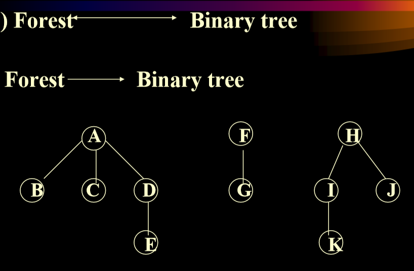


## 3.8. 树的遍历

### 3.8.1. 深度优先遍历(DFS)
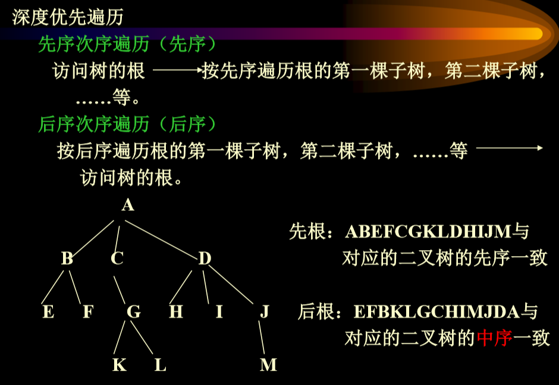

### 3.8.2. 广度优先遍历
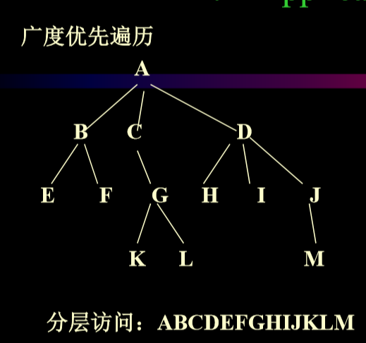

## 3.9. 森林的遍历
1. 应用左子女-右兄弟的二叉树进行遍历

### 3.9.1. 深度优先遍历
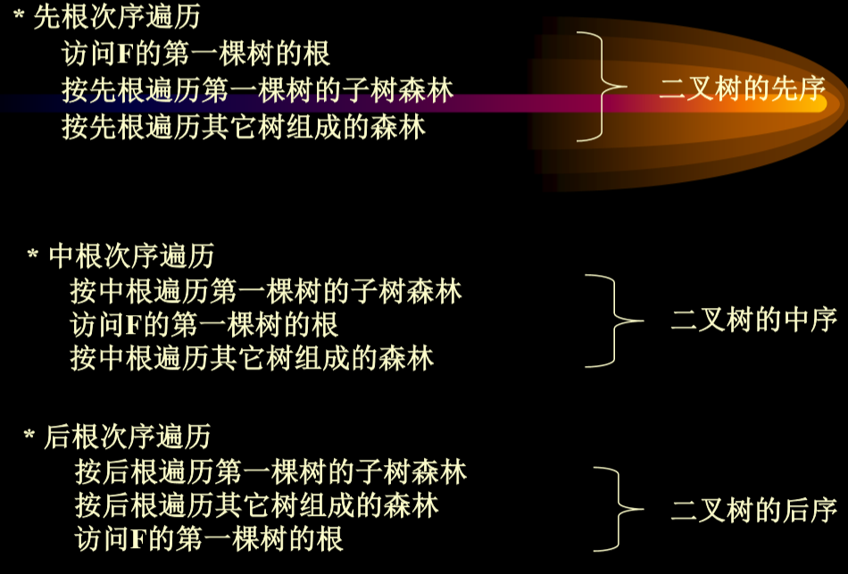

1. Eg.

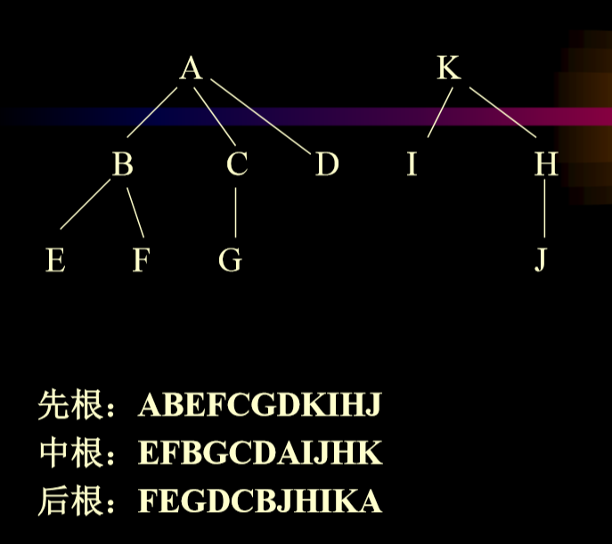

2. 生成左子女-右兄弟二叉树后正常遍历即可

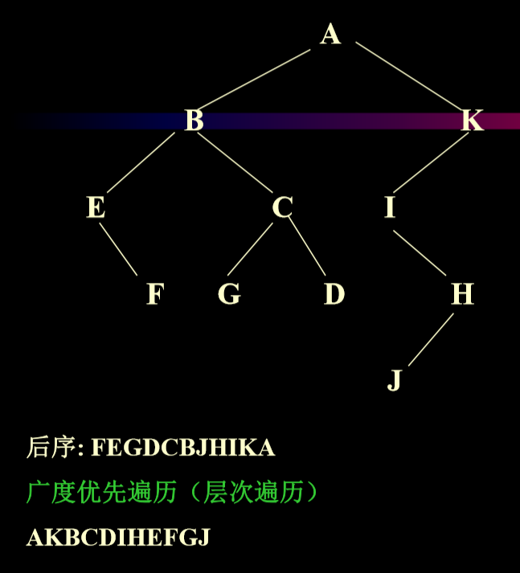

# 4. 线索二叉树
1. 目的:让二叉树遍历的速度更快
2. 特点:在树的节点中加入一个指针(比如指向下一个节点)
3. n个结点的二叉树有2n个链域，其中真正有用的是n–1个，其它n+1个都是空域(null)。为了充分利用结点中的空域，使得对某些运算更快，如前驱或后继等运算。

## 4.1. 例子
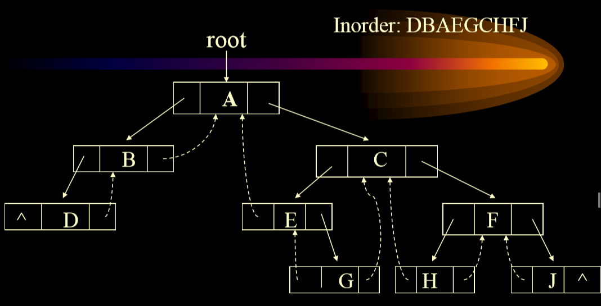

1. 虚线是本身被置为NULL的部分
2. 使用左指针指向中序遍历前项，使用右指针指向中序遍历的后项。
    + 唯二空指针:最左边节点的左指针，最右边节点的右指针
3. 整个树只会有两个空指针

## 4.2. 线索二叉树的结点的数据结构

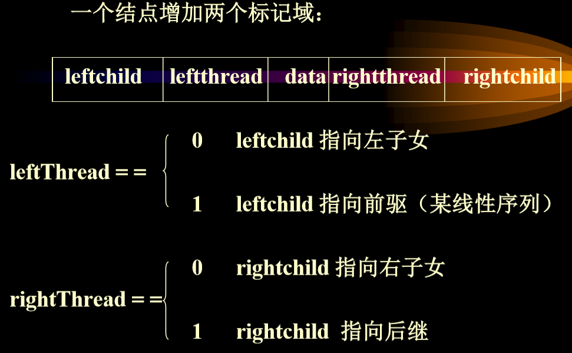

## 4.3. 线索二叉树类的实现
```c++
template< class Type> class ThreadNode {
    friend class ThreadTree;
    private:
        int leftThread, rightThread; 
        ThreadNode<Type>* leftchild, *rightchild;
        Type data;
    public:
        ThreadNode(const Type item):data(item), leftchild(0), rihgtchild(0), leftThread(0), rightThread(0) {}//data初始化为item...
};

template< class Type> class ThreadTree { 
    public:
        //线索二叉树的公共操作
    private:
        ThreadNode<Type> * root; 
        ThreadNode<Type> *current
};
```

## 4.4. 中序遍历已有的中序线索二叉树
1. 按中序遍历中序线索树
    + 遍历算法(以中序为例)：
        + 递归， 非递归(需用工作栈)
    + 这里前提是中序线索树， 所以既不要递归， 也不要栈。
    + 遍历算法：
        + 找到中序下的第一个结点(first)
        + 不断找后继(Next)
    + 如何找后继？

2. 情况一:如果p结点没有右子树(p->rightthread == 1)则 p=p->rightchild(右链就是后继)
3. p有右子树(p->rightThread==0) 则
    1. p=p->rightchild
    2. while(p->leftThread==0) p=p->leftchild;
```c++
//使用是current来记录下来当前节点
template<class Type> ThreadNode<Type>* ThreadInorderIterator<Type>::First() {
    while (current->leftThread==0){
        current = current->leftchild;
    }
    return current;//找中序遍历的第一个节点
}
template<class Type> ThreadNode<Type>* ThreadInorderIterator<Type>::Next() {
    ThreadNode<Type>*p = current->rightchild;//可能是右子树的根节点，也可能是右链 
    if(current->rightThread==0)
        while(p->leftThread==0){
            //如果有右子树就要搜索到最左下部分
            p=p->leftchlid;
        }
    current=p;
}
template<class Type> void ThreadInorderIterator<Type>:: Inorder() { 
    ThreadNode<Type> *p;
    for ( p=Frist(); p!=NULL; p=Next()) 
        cout<< p->data << endl;
}
```

## 4.5. 建立中序线索二叉树
1. 对已存在的一棵二叉树建立中序线索树
2. 分析：与中序遍历算法差不多，但是要填左空域，右空域的前驱、后继指针。所以除了流动指针p外，还要加一个pre指针，它总是指向遍历指针p的中序下的前驱结点。
    + pre相当于记录下来整个遍历顺序来完成链接
3. Eg.

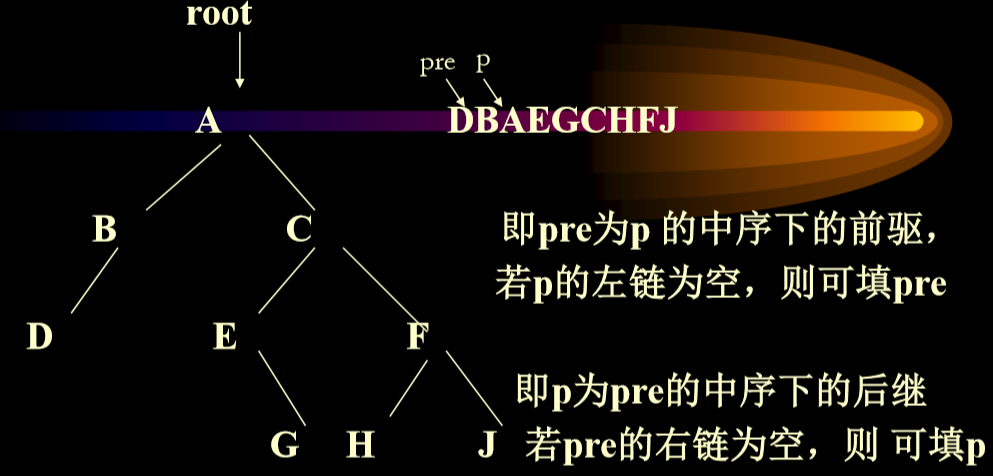

```c++
Void Inthread(threadNode<T> * T) {
    stack <threadNode <T>*> s(10)
    ThreadNode <T> *p = T ;
    ThreadNode <T> *pre = NULL;
    for (;;) {
        //查找到最左下部分的
        while (p!=NULL) {
            s.push(p);
            p = p ->leftchild;
        }
        //开始弹出栈
        if (!s.IsEmpty()){
            p = s.pop;
            if (pre != NULL) {
                //添加的代码，在这时候处理pre
                if (pre ->rightchild == NULL){
                    pre ->rightchild = p;  
                    pre ->rightthread = 1;
                }
                //处理p
                if( p -> leftchild == NULL) {
                    p -> leftchild = pre;
                    p ->leftthread = 1;
                }//添加的代码
            }
            pre = p ;
            p = p -> rightchild ;
        }
        else return;
    }//for 
}//建议把pre和p存储成全局变量
```

# 5. 树的应用

## 5.1. 哈夫曼树(Huffman Tree)

### 5.1.1. 一些概念


1. 增长树(使得原来的树的每一个度数都为2)
    + 对原二叉树中度为1的结点，增加一个空树叶
    + 对原二叉树中的树叶，增加两个空树叶
2. 外通路长度(外路径)E **根到每个外结点**(增长树的叶子)的路径长度的总和(边数)
    + E = 3+3+2+3+4+4+3+3=25，如右上图例
3. 内通路长度(内路径)I：**根到每个内结点**(非叶子)的路径长度的总和(边数)。原来的树上每一个节点到树根的长度的综合
    + I=2+1+0+3+2+2+1=11 如右上图例
4. 结点的带权路径长度：一个结点的权值与结点的路径长度的乘积。
    + 每个结点的权重占有一定的值
5. 带权的外路径长度：各叶结点的带权路径长度之和。
6. 带权的内路径长度：各非叶结点的带权路径长度之和。

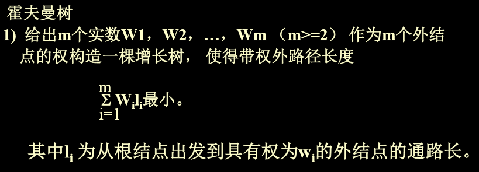

例子如下

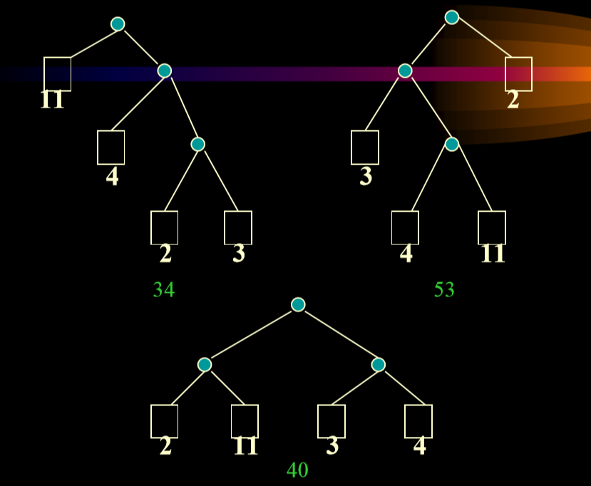

1. 从形状上来讲，二叉树有以上三种大致形状。

### 5.1.2. Huffman算法
1. 思想：权大的外结点靠近根，权小的远离根。
2. 算法：从m个权值中找出两个最小值W1，W2构成

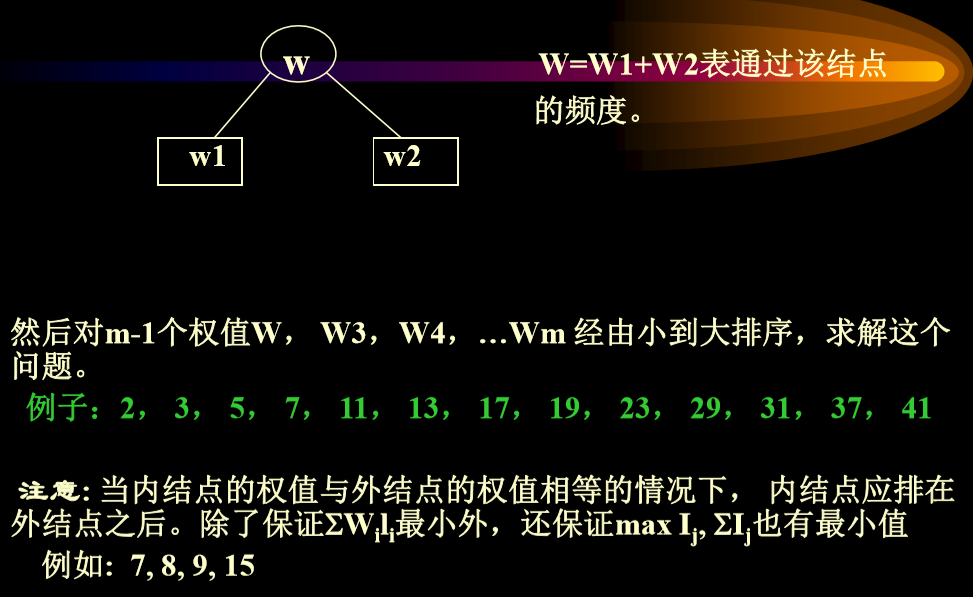

3. 就是把计算结果放进去和其他节点一起选出两个，进行迭代
4. 所以我们就是把数字比较大的挂到距离根比较近的地方
5. 内节点不会只有一个叶节点。

### 5.1.3. 霍夫曼编码
1. 是霍夫曼树在数据编码中一种应用。具体的讲用于通信的二进制编码中。设一电文出现的字符为D={M，S，T，A，Q， K}，每个字符出现的频率为W={10，29，4，8，15，7}，如何对上面的诸字符进行二进制编码，使得
    + 该电文的总长度最短。
    + 为了译码，任一字符的编码不应是另一字符的编码的前缀
2. 根据树情况，我们知道编码是不具有二义性的，必然唯一对应，一个叶节点就一个结果

# 6. 考研例题

## 6.1. 2019年
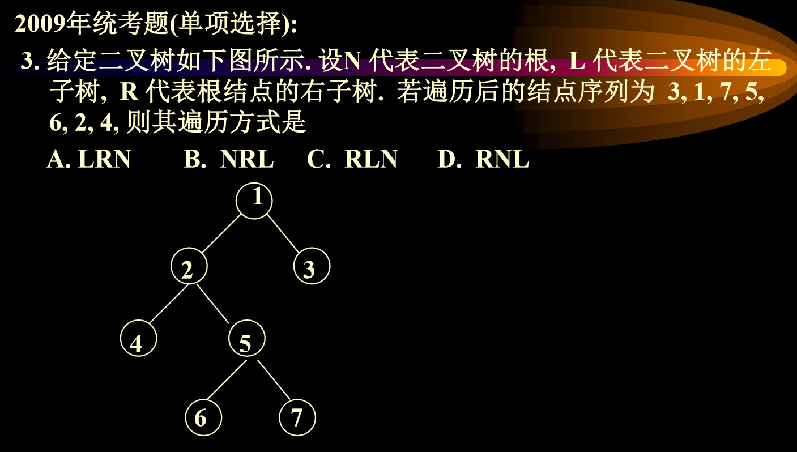

1. D


2. 4题:C 48+63(第六层:8个叶节点+24个根节点)
3. 5题:B 左子女右兄弟，枚举法，v有四种情况，按照左子女右兄弟即可
    + 最左边:不是父子也不是兄弟关系
    + 第二个:父子
    + 第三个:无关系
    + 第四个:兄弟

## 6.2. 2020年

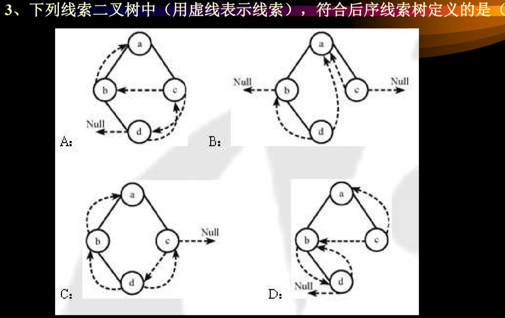

1. 3题:D

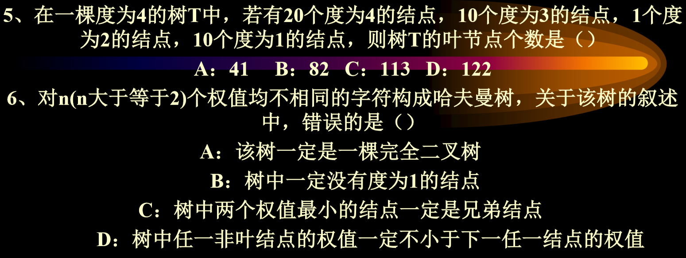

2. 5题:B
    + 总结点数:20*4+10*3+1*2+10*1+1-(20+10+1+10)=82
3. 6题:A
    + 根节点度数可以为1，树中不含树根

# 7. 广义表

## 7.1. 广义表定义
1. 定义为n(n>=0)个表元素a0,a1,a2,……an-1组成的有限序列, 记作: LS=(a0,a1,a2,……an-1)
    + 其中每个表元素ai可以是原子,也可以是子表.
    + 原子: 某种类型的对象,在结构上不可分(用小写字母表示).
    + 子表: 有结构的。(用大写字母表示) 
2. Eg.L = (3,(),(b,c),(((d))))

## 7.2. 广义表基础概念
1. 长度:表中元素的个数
2. 广义表的表头，表尾
    + head= a0;
    + tail= (a1, a2,……an-1)
    + C=(a,(5,3,x))  表头为a,表尾为((5,3,x)) 
3. 广义表的深度:表中所含括号的最大层数

## 7.3. 广义表的性质
1. 有序性
2. 有长度,有深度
3. 可递归,如上面例6
4. 可共享,如E中B为E,D所共享
5. 各种广义表都可用一种示意图来表示,用圆表示表元素, 用长方形表示原子 


## 7.4. 广义表的操作

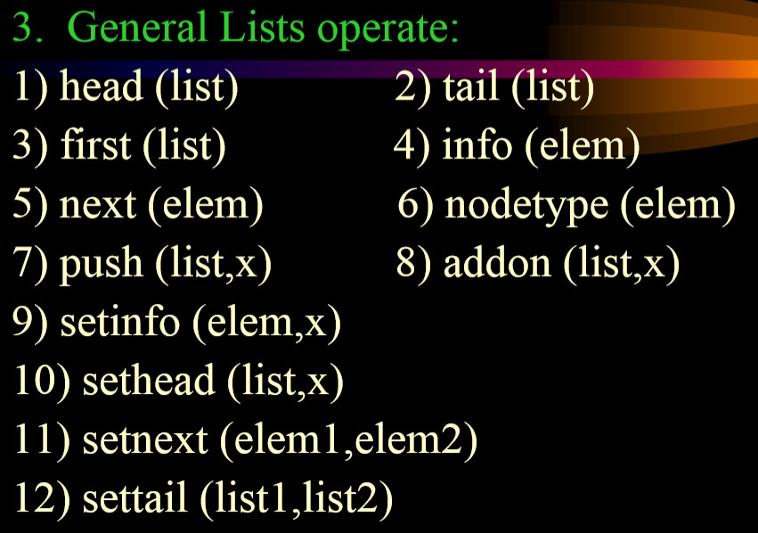

## 7.5. 广义表的实现

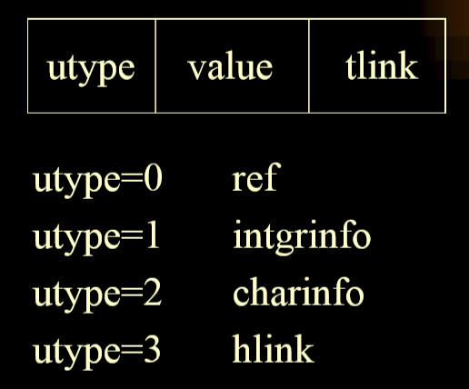

## 7.6. 广义表的类声明
```c++
#define HEAD 0
#define INTGR 1
#define CH 2
#define LST 3
class GenList;
class GenListNode {
    friend class GenList;
    private:
        int utype;
        GenListNode * tlink;
        union {
            int ref;
            int intgrinfo;
            char charinfo;
        GenListNode * hlink;
        } value;
    public:
        GenListNode & info (GenListNode * elem);
        int nodetype (GenListNode * elem) {return elem->utype;}
        void setinfo (GenListNode * elem,GenListNode & x);
    };
class GenList {
    private:
        GenListNode * first;
        GenListNode * Copy (GenListNode * ls);
        int depth (GenListnode * ls);
        int equal (GenlistNode * s, Genlistnode * t);
        void Remove (GenlistNode * ls);
    public:
        GenList ( );
        ~GenList ( );
        GenListNode & Head ( );
        GenListNode * Tail ( );
        GenlistNode * First ( );
        GenlistNode * Next (GenListNode * elem);
        void Push (GenListNode & x);
        GenList & Addon ( GenList & list, GenListNode  & x);
        void setHead (GenListNode  & x);
        void setNext (GenlistNode  * elem1, GenlistNode  * elem2);
        void setTail(GenList & list);
        void Copy (const GenList & l);
        int depth ( );
        int Createlist (GenListNode  * ls, char * s);

}
```

## 7.7. 广义表的实现

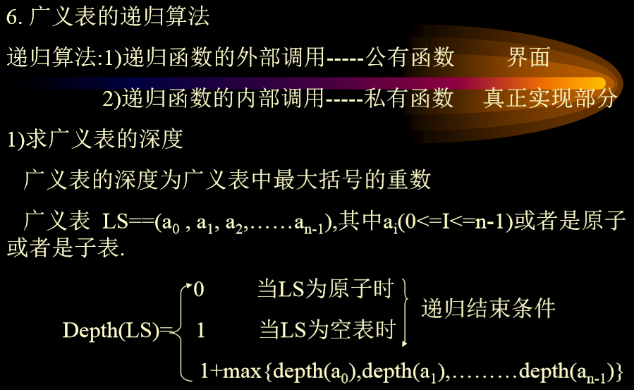

### 7.7.1. 求解广义表深度

```c++
public:
    int GenList::depth( ) { 
        return depth(first);
    }
private:
    int GenList::depth(GenListNode*ls) {
        if( ls-->tlink==NULL) return 1;
        GenListNode*temp=ls-->tlink;
        int m=0;
        while( temp!=NULL) {
            if( temp-->utype==LST) {
                int n=depth(temp-->value.hlink);
                if(m<n)m=n;
            }
            temp=temp-->tlink;
        }
    return m+1;
}
```

### 7.7.2. 判断两个广义表的相等关系
1. 相等的条件: 具有相同的结构，对应的数据元素具有相等的值
```
if(两个广义表都为空表) return相等
else if(都为原子^值相等) 递归比较同一层的后面的表元素
else return 不相等. 
```
```c++
int operator==(const GenList&l,const GenList&m)//假设是友元
{  return equal(l.first, m.first); }

int equal(GenListNode*s, GenListNode*t)//假设是友元
{
    int  x;
    if(s-->tlink==NULL&&t-->tlink==NULL) return 1;
    if((s-->tlink!=NULL&&t-->tlink!=NULL&&s-->tlink-->utype==t-->tlink-->utype) {
        if(s-->tlink-->utype==INTGR)
            if(s-->tlink-->value.intgrinfo== t-->tlink-->value.intgrinfo)x=1;
            else  x=0;
        else if(s-->tlink-->utype==CH)
            if(s-->tlink-->value.charinfo==t-->tlink-->value.charinfo)x=1;
            else  x=0;
        else  x=equal(s-->tlink-->value.hlink, t-->tlink-->value.hlink);
        if(x)return equal(s-->tlink,  t-->tlink);
    }
    return 0;
}
```

### 7.7.3. 广义表的复制算法
1. 分别复制表头,表尾,然后合成，前提是广义表不可以是共享表或递归表
```c++
public:
    void  GenList::copy(const GenList&l) {first=copy(l.first);}
private:
    GenListNode*GenList::copy(GenListNode*ls) {
        GenListNode*q=NULL;
        if(ls!=NULL) {
            q=new GenListNode; q-->utype=ls-->utype;
            Switch(ls-->utype) {
                case  HEAD:  
                    q-->value.ref=ls-->value.ref;
                    break;//表头结点
                case   INTGR: 
                    q-->value.intgrinfo=ls-->value.intgrinfo;
                    break;
                case  CH:
                    q-->value.charinfo=ls-->value.charinfo;
                    break;
                case  LST: 
                    q-->value.hlink=ls-->value.hlink;
                    break;
            }
            q-->tlink=copy(ls-->tlink);
        }
    return q;
    }
```

### 7.7.4. 广义表析构函数
```c++
public:
    GenList::~GenList(){
        remove(first);
    }
private:
    void GenList::remove(GenListNode*ls) {
        ls->value.ref--;
        if (!ls->value.ref) {
            GenListNode*y=ls;
            while(y-->tlink!=NULL) {  
                y=y-->tlink;
                if(y-->utype= =LST)
                    remove(y-->value.hlink);
            }
            y-->tlink=av;
            av=ls;//回收顶点到可利用空间表中
        }
    }
```