Hashing
---

<!-- TOC -->

- [1. 散列函数](#1-散列函数)
  - [1.1. 散列函数的应用](#11-散列函数的应用)
  - [1.2. 散列函数](#12-散列函数)
    - [1.2.1. 如何寻找合适的散列函数](#121-如何寻找合适的散列函数)
    - [1.2.2. 散列函数(1):取余法](#122-散列函数1取余法)
    - [1.2.3. 散列函数(2):平方取中法](#123-散列函数2平方取中法)
    - [1.2.4. 散列函数(3):乘法杂凑函数](#124-散列函数3乘法杂凑函数)
    - [1.2.5. 散列函数(4):针对字符串-1](#125-散列函数4针对字符串-1)
    - [1.2.6. 散列函数(5):针对字符串-2](#126-散列函数5针对字符串-2)
    - [1.2.7. 其他散列函数(考试无要求)](#127-其他散列函数考试无要求)
  - [1.3. 如何解决散列表冲突问题](#13-如何解决散列表冲突问题)
    - [1.3.1. 解决冲突方案(1):linear Probing(线性探测法)](#131-解决冲突方案1linear-probing线性探测法)
    - [1.3.2. 解决冲突方法(2):二次探测法(Quadratic probing)](#132-解决冲突方法2二次探测法quadratic-probing)
    - [1.3.3. 解决冲突方法(3):双散列哈希(Double Hashing)](#133-解决冲突方法3双散列哈希double-hashing)
    - [1.3.4. 解决冲突方法(4):分离链接法(Separate Chaining)](#134-解决冲突方法4分离链接法separate-chaining)
  - [1.4. 散列表的实现](#14-散列表的实现)
    - [1.4.1. 散列表的c++实现](#141-散列表的c实现)
    - [1.4.2. 线性探测法的c++实现](#142-线性探测法的c实现)
    - [1.4.3. 散列表的java实现(二次探测法)](#143-散列表的java实现二次探测法)
    - [1.4.4. 散链表的java实现(分离连接法)](#144-散链表的java实现分离连接法)

<!-- /TOC -->

# 1. 散列函数
1. 散列表(Hash function)
    + Address = hash(key)
2. BT值用来标识文件的**唯一性**，校验值(官方会提供文件的标识值，用同样的算法来计算哈希值，如果不同，则这个文件已经发生过修改)
3. 常用的哈希函数:**奇偶校验法**
4. Eg.如果发生散列函数计算结果冲突(1 = 1)的时候，会使用一些方法来处理所带来的问题(散列表的常数复杂度只在不发生冲突的情况下，在发生冲突的情况下算法复杂度显然不为常数)


## 1.1. 散列函数的应用
1. 通过添加**散列函数**来加快线性列表的读写速度。
2. 散列函数的复杂度理论上能够到达**常数**级别复杂度。
    + Sequention search 线性查找: O(n)，显然在此情况下我们认为访问散列表的每一个位置的数据的概率是均等的。
    + Binary search: O(log2n)
    + hashing method: O(C)
        + Address=hash(key) also called : name-address function(名称-地址映射)

## 1.2. 散列函数

### 1.2.1. 如何寻找合适的散列函数
1. Find a proper hash function How to solve a collision Select a suitable load factor α.(寻找合适的hash函数如何解决冲突选择合适的负载因子α)
2. α=n/b
    + n is number of elements in the hash table b is the number of buckets in the hash table
    + α > 1  碰撞频率大
    + α < 1  碰撞频率小

### 1.2.2. 散列函数(1):取余法

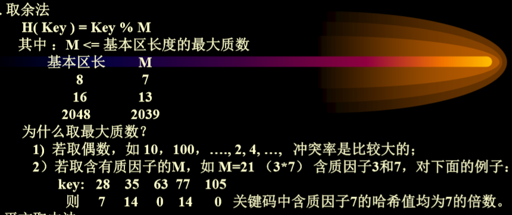

1. 大小通常取最大质数，避免造成散列中存在始终未用到的部分。

### 1.2.3. 散列函数(2):平方取中法


1. 先进行原来的数据进行平方，然后选取中间的合适部分。
2. 对于一个值，按照某一进制下进行处理，处理后选择其中合适的中间部分。(类字符串进行存取)

### 1.2.4. 散列函数(3):乘法杂凑函数


1. %1是留下小数部分

### 1.2.5. 散列函数(4):针对字符串-1
1. to add up the ASCII( or Unicode ) value of the characters in  the string. 把字符串中的每一个字符的ASCII值或者Unicode值相加
```java
public static int hash( String Key, int tableSize ) {
    int hashVal = 0;
    for( int i = 0; i < Key.length( ); i++ )
        hashVal += Key.charAt( i );
    return hashVal % tableSize;
} 
```
2. Suppose  TableSize = 10007, Suppose all the keys are eight or fewer characters long, 8*127=1016 hash function typically can only assume value between 0~1016 引起浪费(字符串过短会导致浪费)

### 1.2.6. 散列函数(5):针对字符串-2


1. 相当于对原来常数级的事情，添加一个常数来形成多项式。

### 1.2.7. 其他散列函数(考试无要求)
1. EL-hash

## 1.3. 如何解决散列表冲突问题
碰撞的两个(或多个)关键码称为同义词, 即H(k1)=H(k2),k1不等于k2 

### 1.3.1. 解决冲突方案(1):linear Probing(线性探测法)
1. If hash(key)= d and the bucket is already occupied then we will examine successive buckets d+1, d+2,……m-1, 0, 1, 2, ……d-1, in the array(如何key的哈希值是d，并且d对应的位置已经被占据，然后我们会按照线性顺序向后成环形查找)
2. 散列表已经满了之后，算法复杂度比较高，需要遍历整个散列表

3. 例一

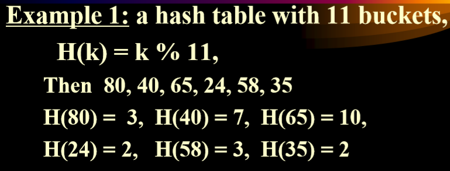
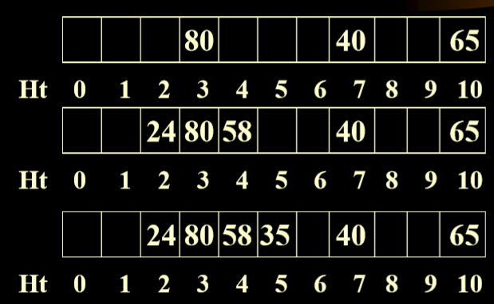

4. 计算例一中的平均成功访问次数


5. 例二

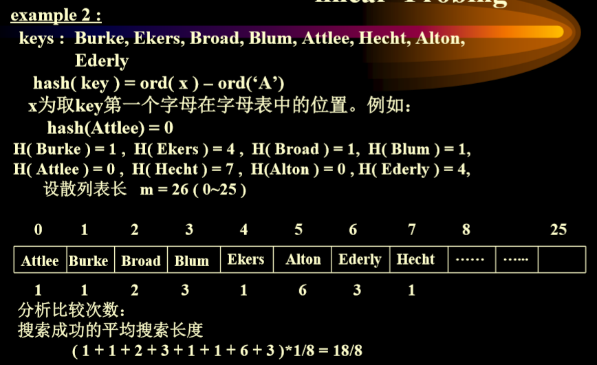

6. 线性表示法的弊端:堆积问题

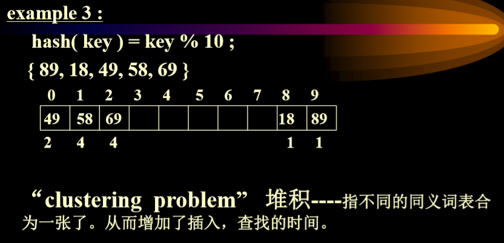

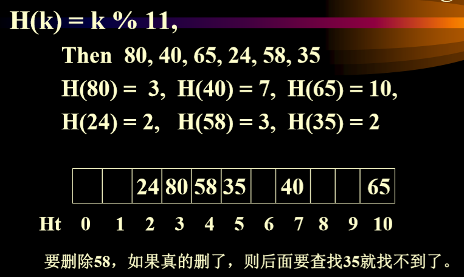

7. 不能直接删除线性表中的数据，应该是标记上删除标记

### 1.3.2. 解决冲突方法(2):二次探测法(Quadratic probing)
1. If hash(k)= d and the bucket is already  occupied then we will examine successive buckets d + 1, d + 2<sup>2</sup>, d + 3<sup>2</sup> ……, in the array
2. 放置hash值相同的情况下导致严重的堆积情况。

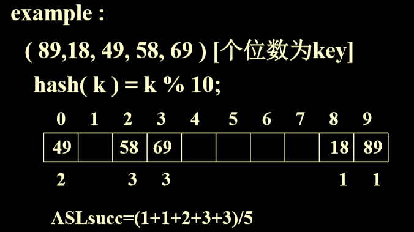

### 1.3.3. 解决冲突方法(3):双散列哈希(Double Hashing)
1. If hash1(k)= d and the bucket is already occupied then we will counting hash2(k) = c, examine successive buckets d+c, d+2c, d+3c……，in the array(如果k的第一哈希值为d，而这个对应的格子已经被占用则我们继续计算k的第二哈希值，然后检查d+c...)

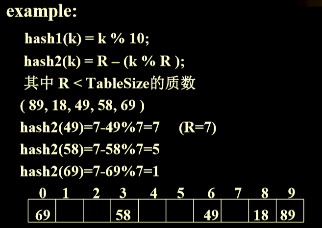

2. 第一个散列函数发生冲突，那么使用第二个散列函数来放置，如果再次冲突则进行相应探测。

3. 再散列(**进行扩容**)

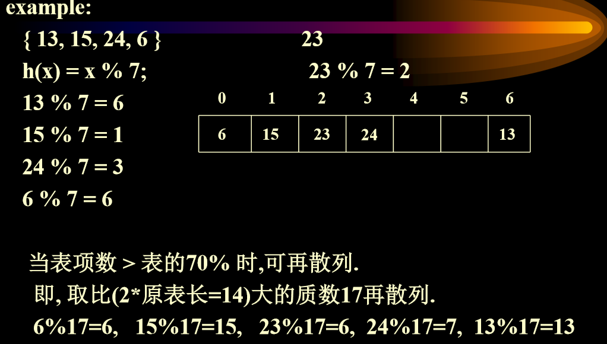

1. 尽量保证表项数>表的70%，也就是意味着如果不满足，就需要进行再散列。

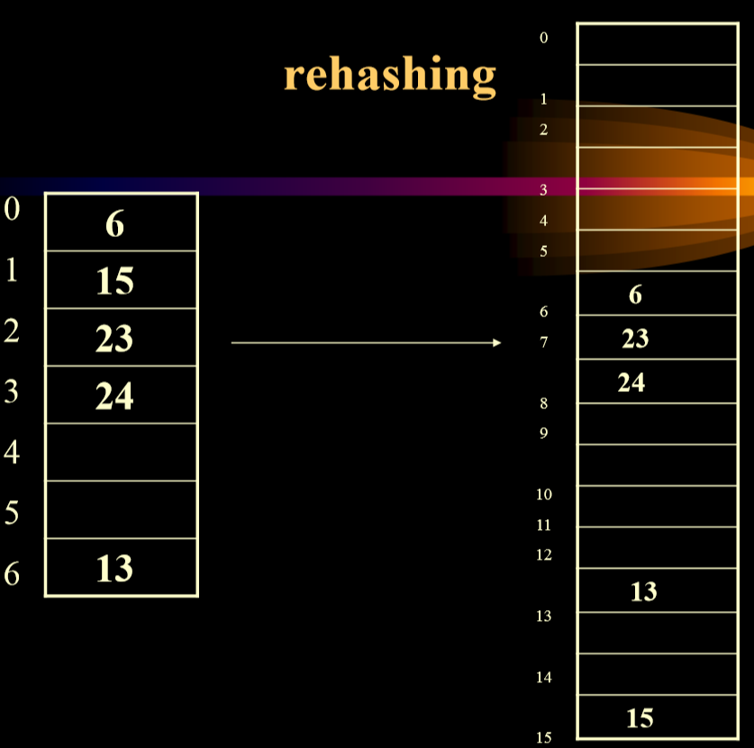

2. 再散列的实现
```java
private void rehash(){
    HashEntry [] oldArray = array ;
    allocateArray(nextPrime(2*oldArray.length));
    currentSize = 0;
    for( int i = 0;i < oldArray.length;i++ )
        if(oldArray[i] != null && oldArray[i].isActive)
            insert(oldArray[i].Element);
}
```

### 1.3.4. 解决冲突方法(4):分离链接法(Separate Chaining)
1. 使用每个位置对应线性表解决这个问题


2. 避免了出现向下进行顺延的情况。

## 1.4. 散列表的实现
1. Assume that each element to be stored in the hash table is of type E and has a field key of type k.(我们假设存储在散列表中的每一元素的类型是E，并且有一个类型为k的关键码)
2. the hash table is implemented using two arrays: ht and empty.(散列表的实现使用了两个数组，一个是ht，另一个是empty)
3. empty[i] is true iff ht[i] does not have an element in it. It is defined for the deletion operation(ht[t]中含有关键码当且仅当empty[i]是true。)

### 1.4.1. 散列表的c++实现
```c++
template<class E,class K>
class HashTable{ 
    public:
        HashTable(int divisor =11);
        ~HashTable(){
            delete[]ht;
            delete []empty;
        }
        bool Search(const K&k ,E& e)const; 
        HashTable<E,K>&Insert(const E&e);
    private:
        int hSearch(const K& k)const;
        int D;//hash function divisor
        E *ht ; //hash table array
        bool *empty ; //1D array
};
```

### 1.4.2. 线性探测法的c++实现
```c++
//hashtable的构造方法
template<class E,class K>//E和K需要被实例化后，这个类才能被调用。
HashTable<E,K>::HashTable(int divisor){
    D = divisor;
    ht = new E[D];
    empty= new bool[D];
    for(int i=0;i<D;i++)
        empty[i] = true;
}

template<class E,class K>
int HashTable<E,K>::hSearch(const K&k)const {
    int i= % D;//home bucket
    int j= i ; //start at home bucket
    do {
        if(empty[j] || ht[j]==k) return j;//fit
        j=(j+1)%D; //next bucket
    } while(j!= i);  //returned to home?是否循环完成一遍
    return j; //table full;
}

//参数进行引用K&k
template<class E,class K>
bool HashTable<E,K>::Search(const K&k,E&e)const{
    //put element that matches k in e.
    //return false if no match.
    int b= hSearch(k);
    if(empty[b]||Hash(ht[b])!=k)return false;
    e=ht[b];
    return true;
}

template<class E,class K>
HashTable<E,K>& HashTable<E,K>::Insert(const E& e) {
     K k=Hash(e);//extract key
     int b=hSearch(k);
     if(empty[b]){
        empty[b]=false;
        ht[b]=e;
        return *this;
    }
    throw NoMem();  //table full
}
```

### 1.4.3. 散列表的java实现(二次探测法)

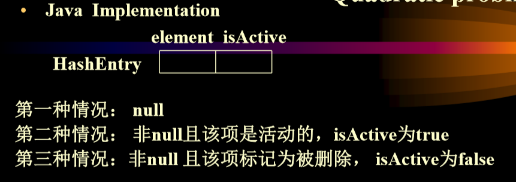

```java
public interface Hashable {
    int hash(int tableSize);
}
class HashEntry {
    Hashable element;
    boolean isActive;
    public HashEntry(Hashable e){this(e, true);
    }
    public HashEntry(Hashable e, boolean i) {
        this.element = e;
        this.isActive = i;
    }
}
public class QuadraticProbingHashTable {   
    public QuadraticProbingHashable()
    public QuadraticProbingHashable(int size)
    public void makeEmpty( )  
    
    public Hashable find(Hashable x)
    public void insert(Hashable x)
    public void remove(Hashable x)  
    
    public static int hash(String key, int tableSize)
    private static final int DEFAULT_TABLE_SIZE = 11;
    
    protected HashEntry [ ] array; private int currentSize;
    private void allocateArray(int arraySize )
    private boolean isActive( int currentPos )
    private int findPos( Hashable x )  
    private void rehash( )//需要扩大hash表大小的时候，再哈希
    private static int nextPrime( int n ) 
    private static boolean isPrime( int n )
}
```

```java
//构造方法
public QuadraticProbingHashTable( ) {
    this( DEFAULT_TABLE_SIZE );
}
public QuadraticProbingHashTable( int size ) {
    allocateArray( size );
    makeEmpty( );
}
//其他方法
private void allocateArray(int arraySize){
    array = new HashEntry[arraySize];
}
//清空哈希表
public void makeEmpty() {
    currentSize = 0;
    for( int i = 0; i < array.length; i++ )
        array[ i ] = null;
}
//查找哈希表元素
public Hashable find(Hashable x) {
    int currentPos = findPos(x);
    return isActive(currentPos)?array[currentPos].element:null;
}
private int findPos(Hashable x) {
    int collisionNum = 0;
    int currentPos = x.hash(array.length); 
    while(array[currentPos] != null && !array[currentPos].element.equals(x)) {
        currentPos += 2*collisionNum – 1;//二次探测法 n2 - (n-1)2= 2n-1
        if(currentPos >= array.length)
            currentPos -= array.length;
    }//如果已经放满，并且要找的值不在里面会进入死循环
    return currentPos;
}
private boolean isActive( int currentPos )  {
    return array[currentPos]!=null && array[ currentPos ].isActive;
}
public void insert(Hashable x) {
    int currentPos = findPos(x);
    if(isActive(currentPos))
        return;
    array[currentPos] = new HashEntry( x, true );
    if( ++currentSize > array.length/2)
        rehash();
}
public final void remove(Hashable x) {  
    int currentPos = findPos(x);
    if(isActive(currentPos))
        array[currentPos].isActive = false;
}
```

### 1.4.4. 散链表的java实现(分离连接法)
```java
public class SeparateChainingHashTable  {  
    public SeparateChainingHashTable( ) 
    public SeparateChainingHashTable( int size )
    public void insert( Hashable x )
    public void remove( Hashable x )
    public Hashable find( Hashable x )  
    public void makeEmpty( )
    public static int hash( String key, int tableSize )  
    
    private static final int DEFAULT_TABLE_SIZE = 101;
    private LinkedList [] theLists;
    private static int nextPrime( int n ) 
    private static boolean isPrime( int n ) 
}

public interface Hashable{
    int hash( int tableSize );
}
public class Employee implements Hashable { 
    public int hash( int tableSize ) { 
        return SeparateChainingHashTable.hash( name, tableSize );
    }
    public boolean equals( object rhs ) { 
        return name.equals( ( Employee) rhs ).name );
    }
    
    private String name;
    private double salary;
    private int seniority;
}

public SeparateChainingHashTable()  {
    this( DEFAULT_TABLE_SIZE );
}
public SeparateChainingHashTable(int size) {
    theLists = new LinkedList[ nextPrime( size ) ];
    for( int i = 0; i < theLists.length; i++ ) theLists[ i ] = new LinkedList( );
}
public void makeEmpty( )  {
    for( int i = 0; i < theLists.length; i++ )
    theLists[ i ].makeEmpty( );
}
public void remove( Hashable x ){
    theLists[ x.hash( theLists.length ) ].remove( x );
}
public Hashable find( Hashable x ) {
    return ( Hashable ) theLists[ x.hash( theLists.length ) ]. Find( x ). Retrieve( );
}
public void insert( Hashable x )  {  
    LinkedList whichList = theLists[ x.hash( theLists.length ) ];
    LinkedListItr itr = whichList.find( x );
    if( itr.isPastEnd( ) )
        whichList.insert( x, whichList.zeroth( ) );
}

```