排序
---

<!-- TOC -->

- [1. 概述](#1-概述)
  - [1.1. 排序算法类定义](#11-排序算法类定义)
- [2. 插入排序](#2-插入排序)
  - [2.1. 直接插入排序](#21-直接插入排序)
    - [2.1.1. 直接插入排序源码](#211-直接插入排序源码)
    - [2.1.2. 算法复杂度分析](#212-算法复杂度分析)
    - [2.1.3. 算法稳定性](#213-算法稳定性)
  - [2.2. 折半插入排序(Binary Insert Sort)](#22-折半插入排序binary-insert-sort)
    - [2.2.1. 源码](#221-源码)
    - [2.2.2. 时间复杂度](#222-时间复杂度)
    - [2.2.3. 折半插入排序稳定性](#223-折半插入排序稳定性)
  - [2.3. 希尔排序(Shell Sort)](#23-希尔排序shell-sort)
    - [2.3.1. 希尔排序的代码实现](#231-希尔排序的代码实现)
    - [2.3.2. 希尔排序的稳定性](#232-希尔排序的稳定性)
    - [2.3.3. 希尔排序算法分析](#233-希尔排序算法分析)
- [3. 交换排序(一类排序算法)](#3-交换排序一类排序算法)
  - [3.1. 冒泡排序](#31-冒泡排序)
    - [3.1.1. 源码](#311-源码)
    - [3.1.2. 冒泡排序算法分析](#312-冒泡排序算法分析)
    - [3.1.3. 冒泡排序算法的稳定性](#313-冒泡排序算法的稳定性)
    - [3.1.4. 冒泡排序算法复杂度分析](#314-冒泡排序算法复杂度分析)
  - [3.2. 快速排序](#32-快速排序)
    - [3.2.1. 算法内容](#321-算法内容)
    - [3.2.2. 例子](#322-例子)
    - [3.2.3. 算法实现](#323-算法实现)
    - [3.2.4. 快速排序算法的稳定性](#324-快速排序算法的稳定性)
    - [3.2.5. 快速排序的时间复杂度](#325-快速排序的时间复杂度)
    - [3.2.6. 空间复杂度](#326-空间复杂度)
    - [3.2.7. 快速排序避免有序情况](#327-快速排序避免有序情况)
    - [3.2.8. 参考](#328-参考)
- [4. 选择排序](#4-选择排序)
  - [4.1. 直接选择排序](#41-直接选择排序)
    - [4.1.1. 源码](#411-源码)
    - [4.1.2. 直接排序算法内容分析](#412-直接排序算法内容分析)
    - [4.1.3. 直接排序时间复杂度](#413-直接排序时间复杂度)
    - [4.1.4. 直接排序稳定性](#414-直接排序稳定性)
  - [4.2. 锦标赛排序](#42-锦标赛排序)
    - [4.2.1. 锦标赛排序的算法分析](#421-锦标赛排序的算法分析)
  - [4.3. 堆排序](#43-堆排序)
    - [4.3.1. 算法思想](#431-算法思想)
    - [4.3.2. 示例](#432-示例)
    - [4.3.3. 代码实现](#433-代码实现)
    - [4.3.4. 堆排序算法复杂度分析](#434-堆排序算法复杂度分析)
- [5. 秩排序(Rank sort)](#5-秩排序rank-sort)
  - [5.1. 源码](#51-源码)
  - [5.2. 秩排序算法性能分析](#52-秩排序算法性能分析)
- [6. 基数排序(Radix Sort)](#6-基数排序radix-sort)
- [7. 归并排序](#7-归并排序)
  - [7.1. 代码实现](#71-代码实现)
  - [7.2. 归并排序](#72-归并排序)
    - [7.2.1. 例子](#721-例子)
    - [7.2.2. 非递归算法c++代码实现](#722-非递归算法c代码实现)
    - [7.2.3. 递归算法java实现](#723-递归算法java实现)
    - [7.2.4. 算法分析](#724-算法分析)
    - [7.2.5. 算法稳定性](#725-算法稳定性)
  - [7.3. 递归的表归并排序](#73-递归的表归并排序)
    - [7.3.1. 算法实现](#731-算法实现)
    - [7.3.2. 有序链表的merge算法](#732-有序链表的merge算法)
    - [7.3.3. 下面讨论divide(List<type>&L1,List<type>L2)](#733-下面讨论dividelisttypel1listtypel2)
- [8. 总结](#8-总结)
- [9. 例题](#9-例题)

<!-- /TOC -->

# 1. 概述
1. 排序：n个对象的序列R[0],R[1],R[2],…R[n-1] 按其关键码的大小，进行由小到大(非递减)或由大到小(非递增)的次序重新排序的。
2. 关键码(key)：进行排序的根据
3. 两大类：
    1. 内排序：对内存中的n个对象进行排序。
    2. 外排序：内存放不下，还要使用外存的排序。(在本节中暂不考虑)
4. 排序算法的稳定性：如果待排序的对象序列中，含有多个关键码值相等的对象，用某种方法排序后，这些对象的相对次序不变的，则是稳定的，否则为不稳定的。例： 35 81 20 15 82 28 81 82 15 20 28 35 稳定的
5.  排序种类
    1. 内排序
        + 插入排序，交换排序，选择排序，归并排序，基数排序
    2. 外排序:本章暂不讨论外排序
6. 排序的算法分析
    1. 时间开销 — 比较次数，移动次数
    2. 所需的附加空间 - 空间开销
7. 下面是静态排序过程中所用到的数据表类定义：

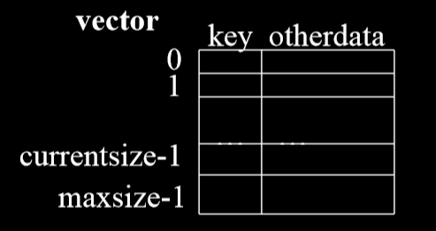

## 1.1. 排序算法类定义
```c++
const int DefaultSize=100;
template<class Type>class datalist;
template<class Type>class Element{ 
    private:
        Type key;
        field otherdata;
    public:
        Type getkey( ){return key;}
        void setKey(const Type x){key=x;} 
        Element<Type>&operator=(Element<Type> &x ){ this = x; } 
        int operator ==(Type & x){return !(this < x||x < this);}
        int operator !=(Type & x){return this < x||x < this;}
        int operator <= (Type & x){return !(this > x);}
        int operator >=(Type & x){return!(this < x);}
        int operator < (Type & x){return  this > x;}
};
template<class Type> class datalist {
    public:
        datalist(int MaxSz=DefaultSize):MaxSize(MaxSz),CurrentSize(0){
            vector=new Element<Type>[MaxSz];
        } 
        void swap (Element <Type> & x, Element<Type> & y){Element <Type> temp=x; x=y; y=temp;}
    private:
        Element <Type> * vector;
        int MaxSize; CurrentSize;
};
```

# 2. 插入排序
1. 排好前面两个，然后在后面的部分进行插入排序。
2. 思想:思想：Ｖ<sub>0</sub>，Ｖ<sub>1</sub>，…，<sub>i-1</sub>个对象已排好序，现要插入Ｖi到适当位置
    + 例子：体育课迟到的人
3. 方法：直接插入排序，链表插入排序，折半插入排序，希尔排序

## 2.1. 直接插入排序

### 2.1.1. 直接插入排序源码
```java
//java
public static void Insert( int [] a , int n, int x) {
    //Insert x into the sorted array a[0:n-1] 
    int i;
    for(i=n-1; i>=0 && x<a[i]; i--)
        a[i+1]=a[i];
    a[i+1]=x;//注意这句话不在for循环中
}
public static void InsertionSort( int [] a,  int n) {
    for(int i=0; i<n; i++) {
        int t = a[i];
        //a[i]是第i+1个值
        Insert(a,i,t);
    }
}
```
1. 比较的时候是从后向前比较的。
2. 合并后的插入排序
```java
//Another version of insertion sort
public static void InsertionSort(int []a, int n) {
    for(int i=0;i<n;i++){
        //insert a[i] into a[0:n-1]
        int t=a[i];
        int j;
        for(j=i-1; j>=0&&t<a[j]; j--)
            a[j+1]=a[j];
        a[j+1]=t;
        //比前面大后推一格
    }
}
```
```c++
template<class Type> void InsertionSort(datalist<Type> & list) {
    for (int i=1; i<list.CurrentSize; i++)
        Insert(list, i);
}
template<class Type> void Insert(datalist<Type> & list, int i) {
    Element<Type> temp=list.vector[i];
    int  j=i ;
    while(j>0&&temp.getkey()<list.vector[j-1].getkey()){
        list.Vector[j]=list.Vector[j-1];
        j--;
    }
    list.Vector[j]=temp;
}
```

### 2.1.2. 算法复杂度分析


1. 额外的两次移动来自于a[i]的取出和放回，除此以外在最坏的情况下会每一次比较都会进行比较。


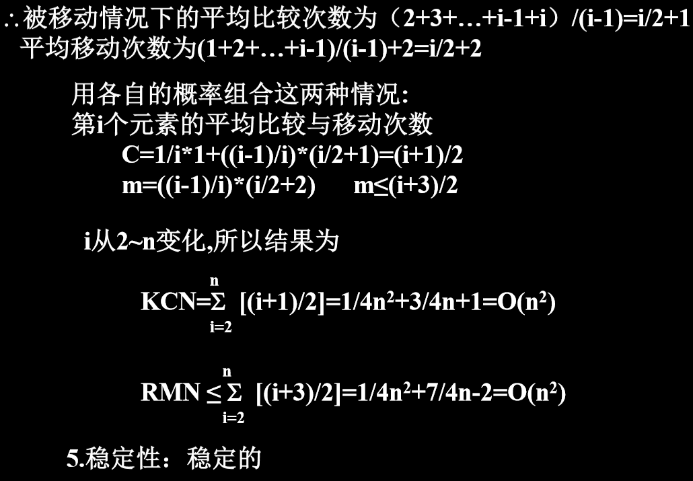

### 2.1.3. 算法稳定性
稳定的

## 2.2. 折半插入排序(Binary Insert Sort)
1. 又称为折半查找


### 2.2.1. 源码
```java
//java
public static int binarySearch( Comparable [] a, Comparable x ) {
    int low = 0, high = a.length - 1;
    while( low <= high ) {
        //计算出中点是哪一个
        int mid = (low+high) / 2;
        //调整两端的值
        if( a[mid].compareTo(x) < 0)
            low = mid + 1; 
        else if(a[mid ].compareTo(x) > 0)
            high = mid – 1;
        else  return mid;
    }
    return "NOT-FOUND";
}
```
```c++
//C++
//可以使用递归，也可以不使用递归
template <class Type> void BinaryInsertSort( datalist<Type> &list) {
    for (int i=1;i<list.currentSize;i++) 
        BinaryInsert(list, i);
}                                         
template <class Type> void BinaryInsert( datalist<Type> &list, int i) {
    int left=0, Right=i-1; 
    Element<Type>temp = list.Vector[i]; 
    while (left<=Right) {
        //调整区间
        int middle=(left+Right)/2;
        if (temp.getkey()<list.Vector[middle].getkey())
            Right=middle-1;
        else
            left=middle+1;
    }
    for(int k=i-1;k>=left;k--)
        list.Vector[k+1]=list.Vector[k];
    list.Vector[left]=temp;
}
```
### 2.2.2. 时间复杂度


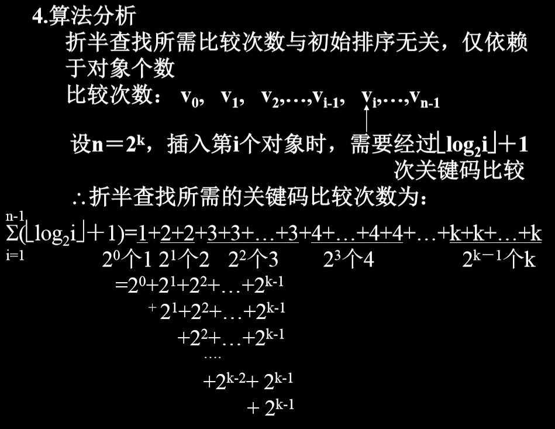


### 2.2.3. 折半插入排序稳定性
算法是稳定的

## 2.3. 希尔排序(Shell Sort)
1. 又称缩小增量排序(diminishing - increament sort)
2. 方法:
    1. 取一增量(间隔gap < n)，按增量分组，对每组使用 直接插入排序或其他方法进行排序。
    2. 减少增量(分的组减少，但每组记录增多)。直至增量为1，即为一个组时。
3. 例子:

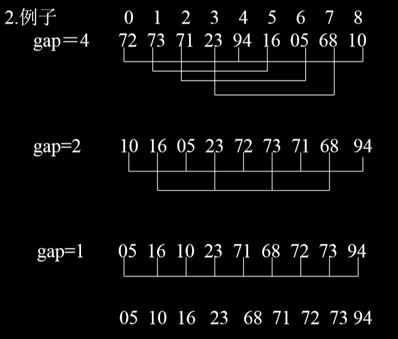

4. 每次完成排序后，gap每次都取一半。

### 2.3.1. 希尔排序的代码实现
```c++
//c++
template <class Type> void Shellsort( datalist <Type> & list) {
    int gap=list.CurrentSize/2;
    while (gap) {
        ShellInsert(list, gap);
        gap=gap= =2? 1 : (int)(gap/2);
    }
}
template<class Type> void ShellInsert( datalist<Type> &list; const int gap) {   
    for (int i=gap; i<list.CurrentSize; i++) {
        Element<Type>temp=list.Vector[i]; 
        int j=i;
        while(j>=gap&&temp.getkey()<list.Vector[j-gap].getkey()) {
            list.Vector[j]=list.Vector[j-gap];
            j-=gap;
        }
    list.Vector[j]=temp;
    }
}         
```
```java
//java
public static void shellsort( Comparable [ ] a ) {
    for (int gap = a.length/2 ; gap>0 ; gap/=2 )
        for (int i = gap; i < a.length; i++) {
            //遍历一遍
            Comparable tmp = a[i];
            int j = i;
            for (;j >= gap && tmp.compareTo( a[j-gap] )< 0;j -= gap )
                //完成一遍下滤
                a[j] = a[j – gap];
            a[j] = tmp;
    }
}
```

### 2.3.2. 希尔排序的稳定性
不稳定的

### 2.3.3. 希尔排序算法分析
1. 与选择的缩小增量有关，但到目前还不知如何选择最好结果的缩小增量序列。
2. 平均比较次数与移动次数大约n<sup>1.3</sup>左右

# 3. 交换排序(一类排序算法)
1. 方法的本质：不断的交换反序的对偶，直到不再有反序的对偶为止。
2. 两种方法：
    1. 冒泡排序(Bubble sort)
    2. 快速排序(Quick sort)

## 3.1. 冒泡排序
1. 每次遍历一次数组，然后仅仅比较相邻的两个数字，最坏的情况时每次只能讲一个数字冒泡上去。
2. 然后遍历n次

### 3.1.1. 源码
```java
//java
public static void Bubble( int [ ] a , int n) {
    //Bubble largest element in a[0:n-1] to right 
    for(int i=0; i<n-1; i++) 
        if(a[i] > a[i+1])
            swap(a[i],a[i+1]);
    }
public static void BubbleSort( int [ ] a, int n) {  
    //Sort a[0:n-1] using a bubble sort 
    for(int i=n ;i>1; i--) 
        Bubble(a,i); 
}
```
```c++
//C++
template<class Type> void  BubbleSort( datalist<Type> & list) {
    int pass=1;
    int exchange=1;
    while (pass<list.CurrentSize &&exchange) {
        BubbleExchange(list, pass, exchange);
        pass++;
    }
}
template<class Type>  void  BubbleExchange(datalist<Type> &list, const int i, int & exchange) {
    exchange=0;
    for (int j=list.CurrentSize-1; j>=i; j--)
        if (list.Vector[j-1].getkey()>list.Vector[j].getkey()) {
            swap(list.Vector[j-1],  list.Vector[j]);
            exchange=1;
        }
}
```

### 3.1.2. 冒泡排序算法分析
1. 进行几次元素之间的比较？
    + 从n-1开始往下比较
2. 进行了几次元素之间的交换
    + 不确定

### 3.1.3. 冒泡排序算法的稳定性
稳定的

### 3.1.4. 冒泡排序算法复杂度分析
1. 最小比较次数
    + 有序：n-1次比较，移动次数为0
2. 最大比较次数
    + 逆序：(n-1)+(n-2)+…+1=n(n-1)/2 约等于 O(n2) (比较次数)
    移动次数 = 3*(1+2+3+...+n)=(3/2)n(n-1) i=1 (移动次数)

## 3.2. 快速排序

### 3.2.1. 算法内容
1. 在n个对象中，取一个对象(如第一个对象——基准pivot)，按该对象的关键码
    1. 把所有**小于等于**该关键码的对象分划在它的左边。
    2. **大于**该关键码的对象分划在它的右边。
2. 对左边和右边(子序列)分别再用快速排序。

### 3.2.2. 例子


### 3.2.3. 算法实现
```c++
//c++
template <class Type> void QuickSort( datalist <Type>& list, const int left,  const int right ) {
    if (left<right) {
        int pivotpos = partition(list, left, right);
        QuickSort(list, left, pivotpos-1);
        QuickSort(list, pivotpos+1, right);
    }
}
//partition
template <class Type> int partition(datalist<Type> &list, const int low, const int high) {
    int i=low,j=high;  Element<Type>pivot=list.Vector[low];
    while (i != j ) {
        while(list.Vector[j].getkey()>pivot.getkey( ) && i<j)
            j--;
        if (i<j) {
            list.Vector[i]=list.Vector[j];
            i++;
        }
        while(list.Vector[i].getkey()<pivot.getkey( ) && i<j)
            i++;
        if (i<j) {
            list.Vector[j]=list.Vector[i];
            j--;
        }
    }
    list.Vector[i]=pivot;
    return i;
}
```
java实现
```java
public static void quicksort( Comparable [ ] a){
    quicksort(a, 0, a.length – 1);
}
private static Comparable median3(Comparable [ ] a, int left, int right ) {
    int center = ( left + right ) / 2;
    if ( a[center].compareTo( a[left ] < 0 )
        swapReferences( a, left, center );
    if ( a[ right ] . compareTo( a[left ]) < 0 )
        swapReferences( a, left, right );
    if( a[right ].compareTo( a[ center ] ) < 0 ) swapReferences( a, center, right );
    //调整了到最后一个位置上
    swapReferences( a, center, right – 1 );
    return a[ right – 1 ];
}
private static void quicksort( Comparable [ ] a, int left, int right ) {
    if( left + CUTOFF <= right ) {   
        Comparable pivot = median3( a, left, right );
        int i = left, j = right – 1;
        for(;;) {
            while(a[ ++i ].comparaTo( pivot  ) < 0 ){}
            while(a[--j].compareTo( pivot ) > 0 ) { }
            if(i < j)
                swapReferences( a, i, j ); 
            else
                break;
        }
        swapReferences(a,i,right – 1);
        quicksort( a, left, i – 1 );
        quicksort( a, i + 1, right );
    } else
        insertionSort( a, left, right );
}
```

### 3.2.4. 快速排序算法的稳定性
不稳定的排序方法

### 3.2.5. 快速排序的时间复杂度
1. 最差的情况(当选第一个对象为分划对象时) 如果原对象已按关键码排好序，此时为O(n<sup>2</sup>)
```
K1[       ]
  K2[     ]
    K3[   ]
       ...
```
2. 最理想的情况：每次分划第一个对象定位在中间

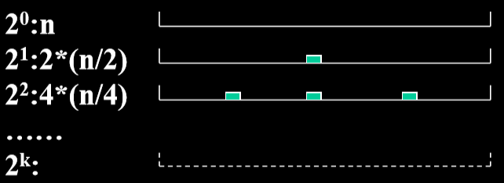

3. 平均情况:设n=2k,一共做了K趟 K=log2n T(n) <= n+2T(n/2) <= n+2(n/2+2T(n/4))=2n+22T(n/22) <= 2n+22(n/22+2T(n/23))=3n+23T(n/23) <= … <= kn+2kT(n/2k)=nlog2n+nT(1)=O(nlog2n)
可以证明Quicksort的平均计算时间也是O(nlog2n)

### 3.2.6. 空间复杂度
1. 以上讨论的是递归算法，也可用非递归算法来实现。 不管是递归(由编译程序来实现)还是非递归。第一次分划后，左部、右部要分别处理。
2. 优先使用左侧小端部分，之后就可以释放
3. 存放什么：左部或右部的上、下界的下标。
4. 栈要多大：O(log2n)- O(n)(有序情况)

### 3.2.7. 快速排序避免有序情况
1. 选取pivot(枢纽元)用第一个元素作pivot是不太好的。
2. 方法1：随机选取pivot, 但随机数的生成一般是昂贵的。
3. 方法2：三数中值分割法(Median-of-Three partitioning) N个数，最好选第(N/2)(向上取整)个最大数，这是最好的中值，但这是很困难的。一般选左端、右端和中心位置上的三个元素的中值作为枢纽元。
    + 8, 1, 4, 9, 6, 3, 5, 2, 7, 0 (8,  6,  0)
    + 具体实现时：将 8，6，0 先排序，即 0, 1, 4, 9, 6, 3, 5, 2 , 7, 8, 得到中值pivot为 6 
4. 分割策略:
    1. 将pivot与最后倒数第二个元素交换，使得pivot离开要被分割的数据段。然后，i 指向第一个元素，j 指向倒数第二个元素。
        + 0, 1, 4, 9, 7, 3, 5, 2,  6,  8
    2. 然后进行分划
5. <a href = "https://www.cnblogs.com/chengxiao/p/6262208.html">三数中值分隔法</a>

### 3.2.8. 参考
1. <a href = "https://www.cnblogs.com/chengxiao/p/6262208.html">图解排序算法(五)之快速排序——三数取中法</a>

# 4. 选择排序
1. 每次找到数组中的最小值找到然后放到前面，进行重复递归。
2. 也可以将最大的数字找出来然后当放到后面。

## 4.1. 直接选择排序
1. 思想:首先在n个记录中选出关键码最小(最大)的 记录，然后与第一个记录(最后第n个记录)交换位置，再在其余的n-1个记录中选关键码 最小(最大)的记录，然后与第二个记录(第n-1个记录)交换位置，直至选择了n－1个记录。

### 4.1.1. 源码
```Java
//java
public static void SelectionSort(int [] a, int n) {
    //sort the n number in a[0:n-1].
    //找到大数字放置到后面
    for(int size = n; size>1; size--){
        //n-1
        int j = Max(a,size);
        //n-1+n-2+...+1
        swap(a[j],a[size-1]);
    }
} 
```
```c++
//c++
template <class Type> void SelectSort(datalist<Type> &list) {
    for ( int i=0; i<list.CurrentSize-1; i++)
        SelectExchange(list, i);
}
template <class Type> void SelectExchange( datalist<Type> & list, const int i) {
    int k=i;
    for ( int j=i+1; j<list.CurrentSize; j++)
        if (list.Vector[j].getkey( )<list.Vector[k].getkey( ))
            k=j;
    if ( k!=i)
        Swap(list.Vactor[i], list.Vector[k]);
}
```

### 4.1.2. 直接排序算法内容分析


1. 一次swap操作中包含3次子操作。
2. 以上均是对于元素操作的统计

### 4.1.3. 直接排序时间复杂度


### 4.1.4. 直接排序稳定性
不稳定的

## 4.2. 锦标赛排序
1. 直接选择排序存在重复做比较的情况，锦标赛 排序克服了这一缺点。
2. 具体方法:
    1. n个对象的关键码两两比较得到(n/2)(向上取整)个 比较的优胜 者(关键码小者)保留下来, 再对这(n/2)(向上取整)个对象再进行关键码的两两比较, ……直至选出一个最小的关键码为止。如果n不是2的K次幂，则让叶结点数补足到满足 2<sup>k</sup> < n <= 2<sup>k</sup>个。
    2. 输出最小关键码。再进行调整：即把叶子结点上，该最小关键码改为最大值后，再进行 由底向上的比较，直至找到一个最小的关键码(即次小关 键码)为止。重复2，直至把关键码排好序。

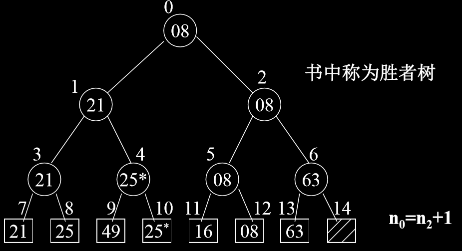

### 4.2.1. 锦标赛排序的算法分析

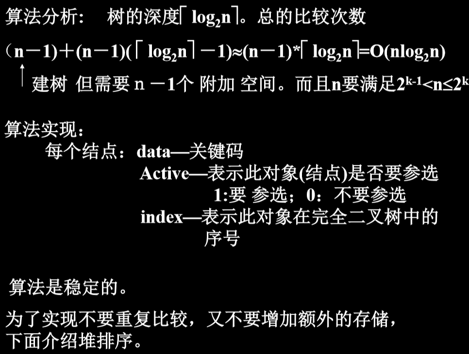

## 4.3. 堆排序
1. 参考heap部分
2. 是固定的算法，从小到大排序，所以一开始建立最大堆，最后调整为最小堆
3. 不稳定的

### 4.3.1. 算法思想
1. 第一步，建堆，根据初始输入数据，利用 堆的调整算法FilterDown()，形成初始堆。(形成最大堆)
2. 第二步，一系列的对象交换和重新调整堆

### 4.3.2. 示例
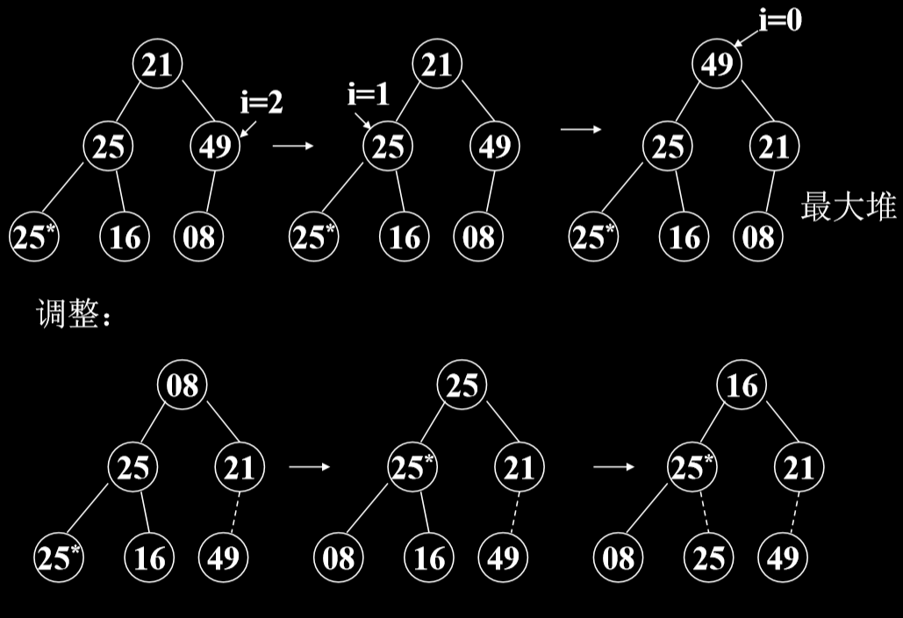


### 4.3.3. 代码实现
```c++
//c++
Template<class  Type>void HeapSort(datalist<Type>&list) {
    for(int i=(list.currentsize-1)/2;i>=0;i--)
        FilterDown(i,list.currentsize-1);
    for(i=list.currentsize-1;i>=1;i--){
        Swap(list.Vector[0],list.vector[i]);
        FilterDown(0,i-1);
    }
}
```

1. FilterDown()就是第6章中的，但要改一下：那里是 建最小堆，这里是建最大堆。

```java
//java program
public static void heapsort( Comparable []a) {
    for( int i = a.length / 2; i >= 0; i-- )
        percDown( a, i, a.length );
    for( int i = a.length – 1; i > 0; i-- ) {
        swapReferences( a, 0, i );
        percDown( a, 0, i);
    }
}
private static int leftChild( int i ) {   
    return 2 * i + 1;
}
private static void percDown( Comparable [ ] a, int  i,  int n ) {
    int child;
    Comparable tmp;
    for( tmp = a[i];leftChild(i) < n ; i = child ) {
        child = leftchild( i );
        if( child!=n – 1&& a[child].compareTo( a[ child + 1 ] ) < 0 )
            child ++;
        if( tmp . compareTo( a[ child ] < 0 )
            a[ i ] = a[ child ];
        else
            break;
    }
    a[i] = tmp;
}
```

### 4.3.4. 堆排序算法复杂度分析

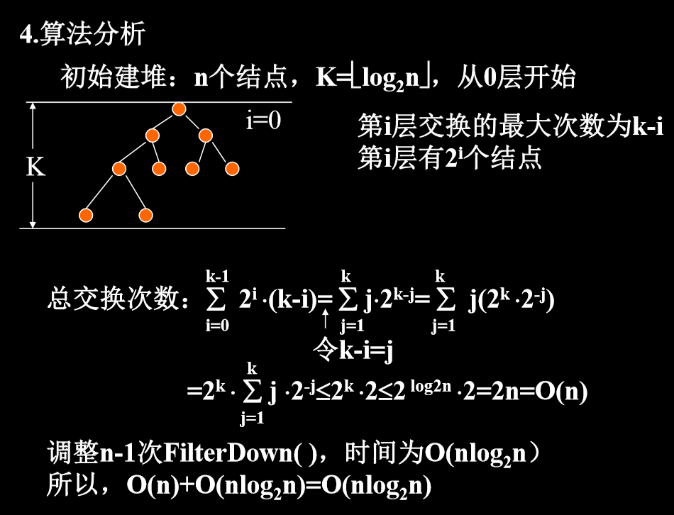

# 5. 秩排序(Rank sort)
1. 重新启用一个数组，用来记录相应的排名

## 5.1. 源码
```java
public static void Rank( int [] a, int n, int [] r) {
    //Rank the n elements a[0:n-1]
    for(int i=0;i<n;i++){
        r[i]=0;
    }
    //首先将全部的数字重置为0
    for(int i=1;i<n;i++)
        for(int j=0;j<i;j++)
            if(a[j]<=a[i])
                r[i]++;
            else
                r[j]++;
            //胜者排名不需要向后增加，而败者需要增加次序。
}
public static void Rearrange( int [ ]a, int n, int[ ] r) {
    //In-place rearrangement into sorted order
    for(int i=0;i<n;i++)
        while(r[i]!=i) {
            //在数组[n]上的应该是第n+1大的数字
            int t=r[i];
            swap(a[i],a[t]);
            swap(r[i],r[t]);
        }
}
```

## 5.2. 秩排序算法性能分析
1. a中元素的比较次数:1+...+n-1
2. a中元素的交换次数:2(n-1-i)
    + 由于while的迭代次数不定，所以很难从代码层面确定次数
    + 从问题本身出发，最多调用2n次交换

# 6. 基数排序(Radix Sort)
1. 先取个位数，按照个位数来放到十个桶里面。
    + 根据先后次序进图桶
2. 按照十位数，继续放入桶中，根据个位排序结果
3. 重复上述操作，直到最高位。
4. 原理:每次让这一位的从前往后排序。

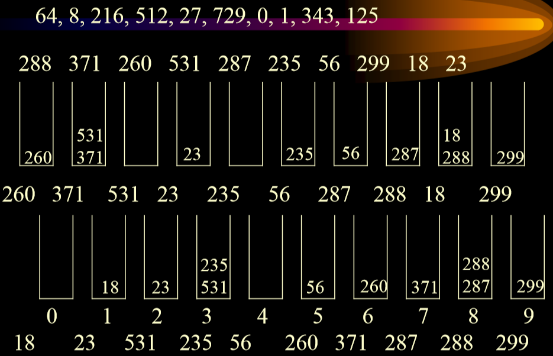
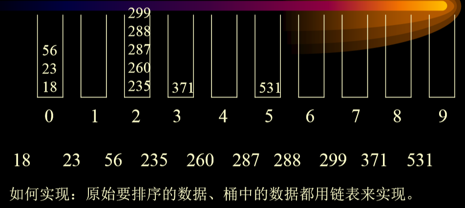

# 7. 归并排序
1. 归并：两个(多个)有序的文件组合成一个有序文件 方法：每次取出两个序列中的小的元素输出之；当一序列完，则输出另一序列的剩余部分


3. 算法思想:分而治之(分治思想)

## 7.1. 代码实现
```c++
//c++
template<class Type> void merge(datalist<Type> & initList, datalist<Type>& mergedList, const int l, const int m, const int n) {
    int i=l, j=m+1, k= l;
    while ( i<=m && j<=n ) if (initList.Vector[i].getkey( )<initList.Vector[j].getkey( )) {
        mergedList.Vector[k]=initList.Vector[i];
        i++;
        k++;
    }
    else{
        mergedList.Vector[k]=initList.Vector[j];
        j++;
        k++;
    }
    if (i<=m)
        for (int n1=k, n2=i; n1<=n && n2<=m;  n1++, n2++)
            mergedList.Vector[n1]=initList.Vector[n2];
    else
        for(int n1=k, n2=j; n1<=n && n2<=n; n1++, n2++)
            mergedList.Vector[n1]=initList.Vector[n2];
}
```

## 7.2. 归并排序
1. 方法
    + n个长为1的对象两两合并，得n/2个长为2的文件
    + n/2个长为 2………………….得n/4个长为4的文件...
    + 2个长为n/2的对象两两合并,得1个长为n的文件


### 7.2.1. 例子


### 7.2.2. 非递归算法c++代码实现
```c++
//c++
template <class Type> void MergeSort(datalist <Type> & list) {
    datalist <Type> tempList(list.MaxSize); 
    int len=1;
    while (len<list.CurrentSize) {
        MergePass(list, tempList, len); len *=2 ;
        if (len >= list.CurrentSize) {
            for (int i=0;i< list.CurrentSize; i++)
                list.Vector[i]=tempList.Vector[i];
        }else{
            MergePass(tempList, list, len); len*=2;
        }
    }
    delete[]tempList;
}
```

1. 当两段均满len长时调用merge
2. 当一长一短时也调用merge(但第二段的参数不同)
3. 当只有一段时，则复抄
4. 块合并算法实现

```c++
//c++
template <class Type> void MergePass( datalist<Type> & initList, datalist <Type> & mergedList, const int len) {
    int i=0;
    while (i+2*len<=initList.CurrentSize-1) {
        merge( initList, mergedList, i, i+len-1, i+2*len-1);
        i+=2*len;
    }
    if(i+len <= initList.CurrentSize-1)
        merge(initList, mergedList, i, i+len-1,initList.CurrentSize-1);//因为有可能有块长度为余数，并不满足结果的，所以要额外处理
    else
        for( int j=i ; j<= initList.CurrentSize; j++)
            mergedList.Vector[j]=initList.Vector[j];
}
```

4. 算法分析：合并趟数log2n,每趟比较n次，所以为O(nlog2n)
5. 稳定性：稳定。

### 7.2.3. 递归算法java实现
```java
//java
public static void mergeSort( Comparable [ ] a ) {
    Comparable [ ] tmpArray = new Comparable[a.length];
    mergeSort( a, tmpArray, 0, a.length – 1 );
}                            
private static void mergeSort( Comparable [ ] a, Comparable [] tmpArray, int left, int right ) {
    if( left < right ) {
        int center = ( left + right ) / 2;
        mergeSort(a, tmparray, left, center );
        mergeSort(a, tmpArray, center + 1, right );
        merge( a, tmpArray, left, center + 1, right );
    }
}
private static void merge( Comparable [ ] a, Comparable [] tmpArray, int leftPos, int rightPos, int rightEnd ) {
    int leftEnd = rightPos – 1;
    int tmpPos = leftPos;
    int numElements = rightEnd – leftPos + 1;
    while( leftPos <= leftEnd && rightPos <= rightEnd )
        if( a[ leftPos ].compareTo( a[ rightPos ] ) <= 0 )
            tmpArray[ tmpPos++ ] = a[ leftPos++ ];
        else
            tmpArray[ tmpPos++ ] = a[ rightPos++ ];
    while( leftPos <= leftEnd )
        tmpArray[ tmpPos++ ] = a[ leftPos++ ];
    while( rightpos <= rightEnd)
        tmpArray[ tmpPos++] = a[ rightpos++ ];
    for( int i = 0; i < numElements; i++, rightEnd-- )
        a[ rightEnd ] = tmpArray[ rightEnd ];
}     
```

### 7.2.4. 算法分析
1. 合并趟数log2n,每趟比较n次，所以为O(nlog2n) 

### 7.2.5. 算法稳定性
1. 稳定性：稳定。

## 7.3. 递归的表归并排序
1. 使用静态链表的方法来实现

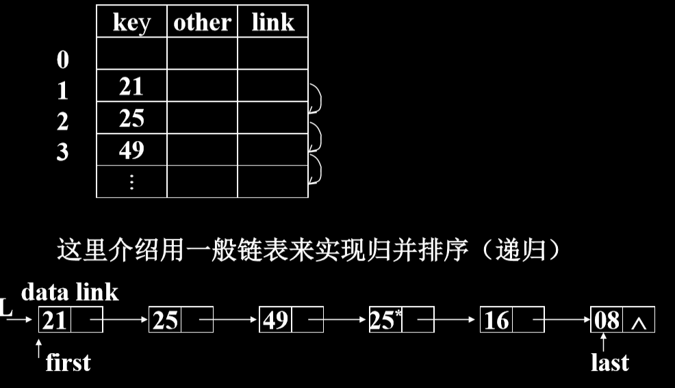

### 7.3.1. 算法实现
1. 主程序 mergesort(L)
2. 子程序 divide(L,L1)，将L划分成两个子表 3.合并两有序序列 merge(L,L1)
```java
void MergeSort (List <Type> &L) {
    List <Type> L1;
    if (L.first!=NULL)
        if (L.first->link != NULL)//至少有两个结点
        {
            divide (L, L1);
            MergeSort(L);
            MergeSort(L1);
            L=merge( L, L1);
        }
}
```
### 7.3.2. 有序链表的merge算法
```c++
//c++
List<Type> & merge (List<Type> &L1, List<Type> & L2) {
    ListNode<Type>*p=L1.first,*q=L2.first,  *r ;
    List<Type> temp;
    if ((p= =NULL) or (q= =NULL)) {
        if (p!=NULL){
            temp.first=p;
            temp.last=L1.last;
        }else{
            temp.first=q;
            temp.last=L2.last;
        }
    }else{
        if (p->data<=q->data) {
            r = p;
            p = p->link;
        }else{
            r = q;
            q = q->link;
        }
        temp.first = r ;
        while((p!=NULL) && (q!=NULL)) {
            if (p->data<=q->data) {
                r->link=p;
                r=p;
                p=p->link;
            }else{
                r->link=q;
                r=q;
                q=q->link;
            }
        }
        if (p= =NULL){
            r->link=q;
            temp.last=L2.last;
        }else {
            r->link=p;
            temp.last=L1.last;
        }
    }
    return temp;
}
```

### 7.3.3. 下面讨论divide(List<type>&L1,List<type>L2)
1. 将L1表分为两个长度几乎相等的表，L1.first指向前半部分，L2.first指向后半部分，要求被划分的表至少含有两个结点。


2. 方法：设两个流动指针p,q指向表的结点 一般来讲让p前进一步，q前进二步，最后当q= NULL时，这时p 恰好指向前半张表的最后一个结点。
3. Eg.如果有10个结点，p走5次，q走10次正好走到表末尾
```java
void divide(List<Type> & L1, List <Type> & L2) {
    ListNode <Type> *p, *q;
    L2.last=L1.last;
    p=L1.first;
    q=p->link;
    q=q->link;
    while (q!=NULL) {
        p=p->link;
        q=q->link;
        if (q!=NULL)
            q=q->link;
    }
    q=p->link;
    p->link=NULL;
    L1.last=p;
    L2.first=q;
}
```

# 8. 总结
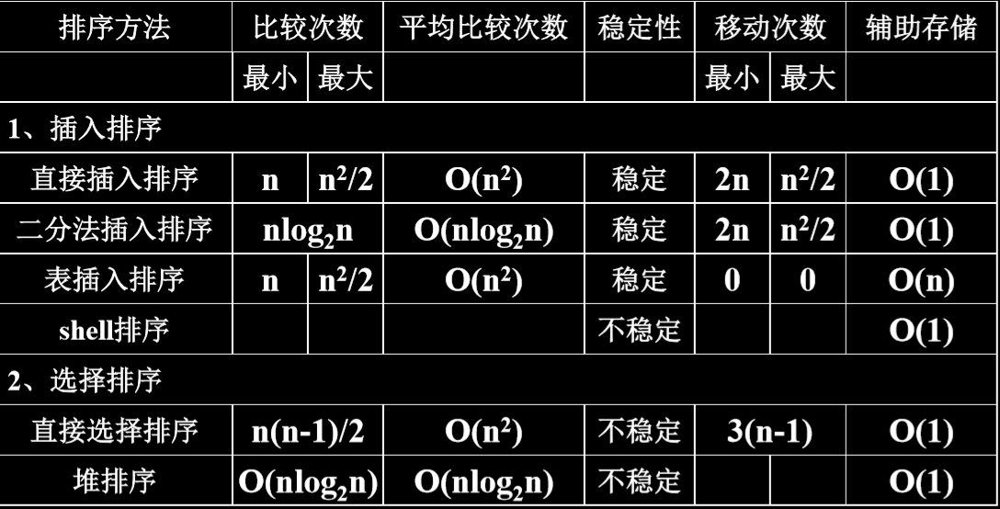


# 9. 例题
1. 若数据元素序列 11, 12, 13, 7, 8, 9, 23, 4, 5 是采用下列排序方法之一得到的第二趟排序后的结果, 则该排序算法只能是 A. 起泡排序 B. 插入排序 C. 选择排序 D. 二路归并排序
2. 首先不是冒泡排序:最大最小值上下，选择排序也是选择最大最小，答案是B
